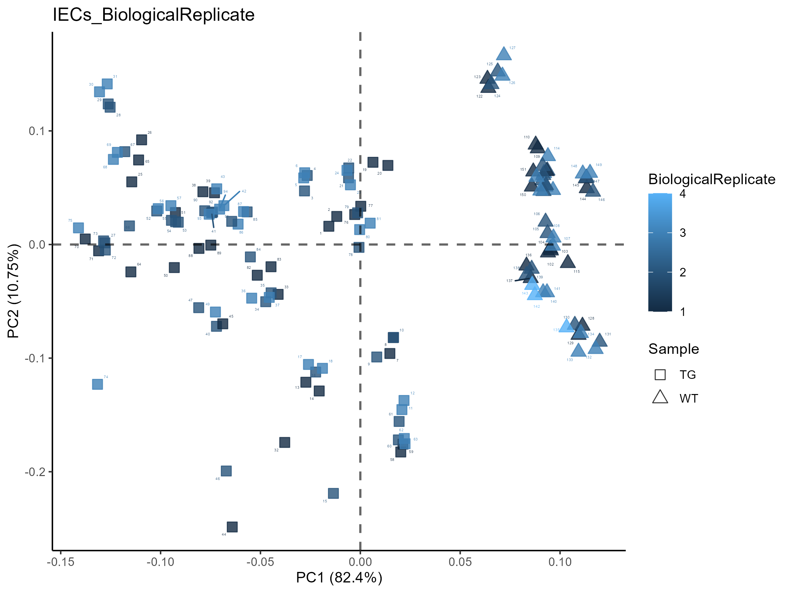

```{r intro-chunk, message=FALSE, warning=FALSE}
#load the needed libraries:
library(tidyverse) # used for data manipulation
library(rmarkdown) # used for paged_table function
library(kableExtra) # used for table
```

```{r normalisation, message=FALSE, warning=FALSE}
Filtering <-function(Input){
  #Find metabolites that have to be removed
  miss <- c()
  for(i in 1:ncol(Input)) {
    if(length(which(is.na(Input[,i]))) > (0.8*nrow(Input)))
    miss <- append(miss,i) 
    }
  #remove metabolites if any are found
  if(length(miss) ==0){
    print("There where no metabolites exluded")
    filtered_matrix <- Input
    } else {
      print(length(miss))
      print(" metabolites where removed")
      filtered_matrix <- Input[,-miss]
      }
}

MVI <-function(Input){
  replace(Input, is.na(Input), ((min(Input, na.rm = TRUE))/2))
}

TIC <- function(Input){
RowSums <- rowSums(Input)
Median_RowSums <- median(RowSums)#This will built the median
Data_TIC_Pre <- apply(Input, 2, function(i) i/RowSums)#This is dividing the ion intensity by the total ion count
Data_TIC <- Data_TIC_Pre*Median_RowSums#Multiplies with the median metabolite intensity 
Data_TIC <- cbind(rownames(Data_TIC), data.frame(Data_TIC, row.names=NULL, check.names=FALSE))%>%
  rename("Code"="rownames(Data_TIC)")
}
```

```{r Heatmap, warning= FALSE, message=FALSE}
library(gplots)
Heatmap <- function(InputMatrix, maximum, minimum, OutputPlotName){
  #Prepare the Input matrix and scale
  dataHeat_matrix <- data.matrix(InputMatrix)
  transpose<-t(scale(dataHeat_matrix))#scale by column
  min(transpose)
  max(transpose)
  t <- as.vector(t(transpose))
  #-------------------------------------------------------
  #functions to centralise the colour palette onto zero
  createLinearColors <- function(numbers, withZero = T, maximum = 100)
  {
    if (min(numbers, na.rm = T) > 0)
    {
      if(withZero)
      {
        numbers <- c(0,numbers)
      }
      myPalette <- colorRampPalette(c("#F5B7B1",  "#EC7063", "#E74C3C", "#CB4335", "#A93226", "#922B21", "#7B241C", "#641E16"))
      myColors <- myPalette(maximum)
    }
    else
    {
      if (max(numbers, na.rm = T) < 0)
      {
        if(withZero)
        {
          numbers <- c(0,numbers)
        }
        myPalette <- colorRampPalette(c("#154360","#1A5276","#1F618D","#2874A6","#2E86C1","#3498DB","#5DADE2","#85C1E9","#D6EAF8"))
        myColors <- myPalette(maximum)
      }
      else
      {
        myPalette_pos <- colorRampPalette(c("#F5B7B1", "#EC7063","#E74C3C","#CB4335", "#A93226","#922B21","#7B241C","#641E16"))
        myPalette_neg <- colorRampPalette(c("#154360","#1A5276","#1F618D","#2874A6","#2E86C1","#3498DB","#5DADE2","#85C1E9","#D6EAF8"))
        
        npos <- length(numbers[numbers >= 0]) + 1
        nneg <- length(numbers[numbers <= 0]) + 1
  
        myColors_pos <- myPalette_pos(npos)
        myColors_neg <- myPalette_neg(nneg)
        
        myColors <- c(myColors_neg[-(nneg)], myColors_pos[-1])
      }
    }
    return(myColors)
  }
  #------------------------------------------
  # Color palette normalization to zero
  palette1 <- createLinearColors(t[t < 0],withZero = T , maximum = paste(maximum))
  palette2 <- createLinearColors(t[t > 0],withZero = T , maximum = paste(minimum))
  palette <- c(palette1,palette2)
  #------------------------------------------
  #Make the Heatmap
  Heatmap <- heatmap.2(transpose, #the data frame we use
          margins = c(7,14),#Figure Margins
          col=palette,
          scale="none", #data scaling
          hclustfun=function(d) hclust(d, method="ward.D"), 
          Rowv=T, 
          Colv=T, 
          symm=F,
          symkey=F,
          symbreaks=F,
          density.info="none", 
          trace="none",
          main = paste(OutputPlotName),
          key.title = "Metabolite Intensity",
          key.xlab = NA,
          cexRow=0.1, 
          cexCol=0.2, 
          ColSideColors=cols1)
  #ggsave(file=paste("Heatmap", OutputPlotName, ".pdf", sep="_"), plot=Heatmap, width=10, height=8)
  #ggsave(file=paste("Heatmap", OutputPlotName, ".png", sep="_"), plot=Heatmap, width=10, height=15)
    }
```

```{r PCA, message=FALSE, warning=FALSE}
library(devtools)
library(ggfortify)
library(ggplot2)
library(RColorBrewer)
library(viridisLite)
library(viridis)#https://cran.r-project.org/web/packages/viridis/vignettes/intro-to-viridis.html

PCA_NoLoadings <- function(InputMatrix,OutputPlotName, DF, Color, Shape){
  PCA <- autoplot (prcomp(InputMatrix),
         data = DF,
         colour = Color,
         label=T,
         label.size=1,
         label.repel = TRUE,
         #loadings=T, #draws Eigenvectors
         #loadings.label = TRUE,
         #loadings.label.vjust = 1.2,
         #loadings.label.size=2,
         #loadings.colour="grey10",
         #loadings.label.colour="grey10",
         fill = Color,#fill colour of the dots
         color = "black",#outline colour
         alpha = 0.8,#controls the transparency: 1 = 100% opaque; 0 = 100% transparent.
         shape = Shape,#https://rpkgs.datanovia.com/ggpubr/reference/show_point_shapes.html, 21
         size = 3.5#size of the dot
         )+
    labs(col=Color, size=1)+
    scale_shape_manual(values=c(22,24,21,23,25,7,8,11,12))+ #needed if more than 6 shapes are in place
    theme_classic()+
    geom_hline(yintercept=0, linetype="dashed", color = "black", alpha=0.6, size=0.75)+
    geom_vline(xintercept = 0, linetype="dashed", color = "black", alpha=0.6, size=0.75)+
    ggtitle(paste(OutputPlotName))
  ggsave(file=paste("Figures/Metabolomics/PCA_Color", OutputPlotName, ".pdf", sep="_"), plot=PCA, width=8, height=6)
  ggsave(file=paste("Figures/Metabolomics/PCA_Color", OutputPlotName, ".png", sep="_"), plot=PCA, width=8, height=6)
  plot(PCA)
}
```

```{r DMA, warning= FALSE, message=FALSE}
#Establish function that calcluates the Log2FC, the t-test p-value, and the bonferroni adjusted p-value
#Function:
library(gtools)#used for "foldchange"
DMA <-function(Log2FC_Condition1, Log2FC_Condition2,Stat_Condition1, Stat_Condition2, Output){
  #Log2FC
  FC_C1vC2 <- mapply(foldchange,Log2FC_Condition1,Log2FC_Condition2)
  Log2FC_C1vC2 <- as.data.frame(foldchange2logratio(FC_C1vC2, base=2))
  Log2FC_C1vC2 <- cbind(rownames(Log2FC_C1vC2), data.frame(Log2FC_C1vC2, row.names=NULL))
  names(Log2FC_C1vC2)[names(Log2FC_C1vC2) == "rownames(Log2FC_C1vC2)"] <- "Metabolite"
  names(Log2FC_C1vC2)[names(Log2FC_C1vC2) == "foldchange2logratio.FC_C1vC2..base...2."] <- "Log2FC"
  #t-test
  T_C1vC2 <-mapply(t.test, x= as.data.frame(Stat_Condition2), y = as.data.frame(Stat_Condition1), SIMPLIFY = F)
  VecPVAL_C1vC2 <- c()
  for(i in 1:length(T_C1vC2)){
    p_value <- unlist(T_C1vC2[[i]][3])
    VecPVAL_C1vC2[i] <- p_value
  }
  Metabolite <- colnames(Stat_Condition2)
  PVal_C1vC2 <- data.frame(Metabolite, VecPVAL_C1vC2)
  #Bonferroni p-adjusted
  VecPADJ_C1vC2 <- p.adjust((PVal_C1vC2[,2]),method = "bonferroni", n = length((PVal_C1vC2[,2])))
  PADJ_C1vC2 <- data.frame(Metabolite, VecPADJ_C1vC2)
  STAT_C1vC2 <- merge(PVal_C1vC2,PADJ_C1vC2, by="Metabolite")
  STAT_C1vC2 <- merge(Log2FC_C1vC2,STAT_C1vC2, by="Metabolite")
  names(STAT_C1vC2)[names(STAT_C1vC2) == "VecPVAL_C1vC2"] <- "p.val"
  names(STAT_C1vC2)[names(STAT_C1vC2) == "VecPADJ_C1vC2"] <- "p.adj"
  Output <- STAT_C1vC2
}
```

```{r VolcanoPlot, warning= FALSE, message=FALSE}
# InputData needs to include columns: "Metabolite", "Log2FC", "p.adj" and "p.val"
library(ggrepel)
library(EnhancedVolcano)
VolcanoPlot <- function(InputData, OutputPlotName){
  VolcanoPlot <- EnhancedVolcano (InputData,
                lab = InputData$Metabolite,#Metabolite name
                x = "Log2FC",#Log2FC
                y = "p.adj",#p-value or q-value
                xlab = bquote(~Log[2]~ "FC"),
                ylab = bquote(~-Log[10]~p.adj),#(~-Log[10]~adjusted~italic(P))
                pCutoff = 0.05,
                FCcutoff = 0.5,#Cut off Log2FC, automatically 2
                pointSize = 4,
                labSize = 2.5,
                titleLabSize = 16,
                col=c("black", "grey", "grey", "purple"),#if you want to change colors
                colAlpha = 0.5,
                title=paste(OutputPlotName),
                subtitle = bquote(italic("Differential Metabolomics Analysis (DMA)")),
                caption = paste0("total = ", nrow(InputData), " Metabolites"),
                #xlim = c(-3.5,2.5),
                ylim = c(0,(ceiling(-log10(Reduce(min,InputData$p.adj))))),
                #drawConnectors = TRUE,
                #widthConnectors = 0.5,
                #colConnectors = "black",
                cutoffLineType = "dashed",
                cutoffLineCol = "black",
                cutoffLineWidth = 0.5,
                #legendLabels=c('No changes',"-0.5< Log2FC <0.5", 'p.adj<0.05 & -0.5< Log2FC <0.5"'),
                legendPosition = 'right',
                legendLabSize = -1,
                legendIconSize = -1
                )
  ggsave(file=paste("Figures/Metabolomics/VolcanoPlot_padj", OutputPlotName, ".pdf", sep="_"), plot=VolcanoPlot, width=10, height=8)
  plot(VolcanoPlot)
#Plot p-value:
  VolcanoPlot1 <- EnhancedVolcano (InputData,
                lab = InputData$Metabolite,#Metabolite name
                x = "Log2FC",#Log2FC
                y = "p.val",#p-value or q-value
                xlab = bquote(~Log[2]~ "FC"),
                ylab = bquote(~-Log[10]~p.val),#(~-Log[10]~adjusted~italic(P))
                pCutoff = 0.05,
                FCcutoff = 0.5,#Cut off Log2FC, automatically 2
                pointSize = 4,
                labSize = 2.5,
                titleLabSize = 16,
                col=c("black", "grey", "grey", "purple"),#if you want to change colors
                colAlpha = 0.5,
                title=paste(OutputPlotName),
                subtitle = bquote(italic("Differential Metabolomics Analysis (DMA)")),
                caption = paste0("total = ", nrow(InputData), " Metabolites"),
                #xlim = c(-3.5,2.5),
                ylim = c(0,(ceiling(-log10(Reduce(min,InputData$p.val))))),
                #drawConnectors = TRUE,
                #widthConnectors = 0.5,
                #colConnectors = "black",
                cutoffLineType = "dashed",
                cutoffLineCol = "black",
                cutoffLineWidth = 0.5,
                #legendLabels=c('No changes',"-0.5< Log2FC <0.5", 'p.val<0.05 & -0.5< Log2FC <0.5"'),
                legendPosition = 'right',
                legendLabSize = -1,
                legendIconSize = -1
                )
  ggsave(file=paste("Figures/Metabolomics/VolcanoPlot_val", OutputPlotName, ".pdf", sep="_"), plot=VolcanoPlot1, width=10, height=8)
  plot(VolcanoPlot1)
}
```

# Information
The notebook contains:\
1. Metabolomics data of DARS2-deficient and WT intestinal epithelial cell (IECs) that were analysed by liquid chromatography-mass spectrometry (LC-MS).\
2. Metabolomics data of total small intestinal proximal tissue from Dars2fl/fl mice 7 days upon tamoxifen that were analysed by liquid chromatography-mass spectrometry (LC-MS).\
LC-MS data aquistion has been performed by the Frezza Laboratory, CECAD Research Center, Faculty of Medicine, University Hospital Cologne, Germany. Input data will be available upon publication in the folder "InputData/Metabolomics".\
\
Code for the R analysis can be reproduced by following this notebook. This includes the data normalisation, differential metabolite analysis and all subsequent plots (PCA plot, Volcano plot).

# Preparation of the Supplementary Data Tables
## Sheet 1: Raw Data
```{r, message=FALSE, warning=FALSE}
#Load the data:
data_IEC <- read.csv("InputData/Metabolomics/RawData_IEC.csv", check.names=FALSE)

```

## Sheet 2: Normalised data
Total pools of the intracellular metabolites are used.

```{r, message=FALSE, warning=FALSE}
#Prepare the matrix
x_IEC <- data_IEC[,8:219]
row.names(x_IEC) <- data_IEC$Code
x_IEC <- replace(x_IEC,x_IEC == 0,NA)
```

### Normalisation
Step1: Filtering 80% Rule\
Metabolites which where detected with "NA" in more than 80% of the samples are excluded: Here none.\
\
Step2: Missing Value Imputation (MVI)
   - We will search for the smallest detected value (x)\
   - We will divide this value by 2 (x:2)\
   - We will replace all "NA" with the value (x:2)\
\
Step3: Normalisation\
Normalisation to total ion count (TIC)

```{r, message=FALSE, warning=FALSE}
#IECs
IEC_filt <- Filtering(Input=x_IEC)
IEC_MVI <-MVI(IEC_filt)
IEC_TIC <- TIC(IEC_MVI)

#Merge with SampleInfo
IEC_norm <-  merge(data_IEC[,c(1:7)], IEC_TIC, by="Code", check.names=FALSE)

```

### Quality control: Mark Outliers
Here we perform ["muma"](https://cran.r-project.org/web/packages/muma/muma.pdf) (Metabolomics Univariate and Multivariate Analysis) analysis for outliers. This uses the Hotellin's T2 distribution test to estimate outliers (Here: Pareto scaling used)

```{r,, message=FALSE, warning=FALSE, eval=FALSE}
Muma_Intra_IEC <- IEC_norm
Muma_Intra_IEC <- Muma_Intra_IEC[,c(1,5,8:219)]
names(Muma_Intra_IEC)[names(Muma_Intra_IEC) == "Code"] <- "sample"
names(Muma_Intra_IEC)[names(Muma_Intra_IEC) == "BiologicalReplicate"] <- "class"
write.csv(Muma_Intra_IEC, "OutputData/Metabolomics/Muma/Muma_IEC.csv", row.names=FALSE)

library(muma)
explore.data("OutputData/Metabolomics/Muma/Muma_IEC.csv",
             "Pareto",#scaling is performed
             normalize=FALSE,
             imputation = FALSE)
getwd()
#Test for Outlier based on geometric distances of each point in the PCA score plot from a 95:
Plot.pca(1,#an integer indicating the principal component to be plotted in x
         2,#an integer indicating the principal component to be plotted in y
         "Pareto",#scaling previously specified in the function ’explore.data’
         test.outlier=TRUE)#geometric outlier testing
```
\

\
WT Mouse 1 is an outlier for all the replicates. In order to confirm this further, we plotted an overview Heatmap including all metabolites:\
```{r, warning= FALSE, message=FALSE}
#Prepare InputData:
dataHeat <- IEC_norm
row.names(dataHeat) <- dataHeat$Code
dim(dataHeat)
Input_dataHeat <- dataHeat[,8:219]

#Prepare sample color code:
cols1 <- case_when(dataHeat$Sample == "WT"  ~ 'blue',
                   dataHeat$Sample == "TG"  ~ 'red',
                   TRUE ~ 'grey')
  
#Make the Heatmap:
Heatmap(InputMatrix=Input_dataHeat, maximum=46, minimum=53, OutputPlotName="IECs")
```
\
Here the outlier is confirmed and hence, we removed WT Mouse 1. Moreover, we spot that M21(BiologicalReplicate 3) is potentially also an outlier.\
Hence, we repeated the muma analysis after removing the WT Mouse 1 (Analysis_2):\
```{r, eval=FALSE}
Muma_Intra_IEC_Select <- IEC_norm[-c(95:101),]
Muma_Intra_IEC_Select <- Muma_Intra_IEC_Select[,c(1,5,8:219)]
names(Muma_Intra_IEC_Select)[names(Muma_Intra_IEC_Select) == "Code"] <- "sample"
names(Muma_Intra_IEC_Select)[names(Muma_Intra_IEC_Select) == "BiologicalReplicate"] <- "class"
write.csv(Muma_Intra_IEC_Select, "OutputData/Metabolomics/Muma/Muma_IEC_OutlierRemoved.csv", row.names=FALSE)

#I had to remove the first rwo in .csv
#I changed class entries to not have the replicates colour coded, but the sample class!
explore.data("OutputData/Metabolomics/Muma/Muma_IEC_OutlierRemoved.csv",#Data need to be imported as a .csv
             "Pareto",#scaling is performed
             normalize=FALSE,
             imputation = FALSE)
getwd()
#Test for Outlier based on geometric distances of each point in the PCA score plot from a 95:
Plot.pca(1,#an integer indicating the principal component to be plotted in x
         2,#an integer indicating the principal component to be plotted in y
         "Pareto",#scaling previously specified in the function ’explore.data’
         test.outlier=TRUE)#geometric outlier testing
```
\


\
From here we see that the sample TG_M21_3_1 is an outlier, which we already noticed in the heatmap above. Hence we will also removed this sample.
```{r, message=FALSE, warning=FALSE}
#Mark Outliers and safe:
IEC_norm_outliers <- IEC_norm%>%
  mutate(Excluded = case_when(Mouse_Number == "M1" ~ 'YES',
                              Code == "TG_M21_3_1" ~ 'YES',
                                   TRUE ~ 'NO'))

IEC_norm_outliers <-IEC_norm_outliers[,c(1,220,2:219)]
write.csv(IEC_norm_outliers, "OutputData/Metabolomics/Sheet2_IECs_MVI-TIC-normalised_OutliersMarked.csv", row.names=FALSE)

#Remove Outliers for downstream analysis:
IEC_norm_NOoutliers <- subset(IEC_norm_outliers,Excluded == "NO")

```

### PCA-Plots
1. Color code by samples --> which samples cluster together?\
2. Color code for replicate --> is there a batch effect we need to correct for?\
```{r, message=FALSE, warning=FALSE, include=FALSE}
PCA_Data <- IEC_norm_NOoutliers

#We are making a numeric matrix of the data:
dim(PCA_Data)
PCA_Data_m<- PCA_Data[,9:220]
PCA_Data_m <- apply(as.matrix(PCA_Data_m), 2, as.numeric)
row.names(PCA_Data_m) <- PCA_Data$Code

#------------------
#Plots:
PCA1<- PCA_NoLoadings(InputMatrix = PCA_Data_m ,OutputPlotName= "IECs_Sample", DF=PCA_Data, Color = "Sample", Shape = "Sample")
PCA_NoLoadings(InputMatrix = PCA_Data_m ,OutputPlotName= "IECs_BiologicalReplicate", DF=PCA_Data, Color = "BiologicalReplicate", Shape = "Sample")
```
\

\


## Sheet 3: Mean of analystical replicates
Each sample was measured at least two times (independent injections). Here we built the mean of these analytical replicates after removing the outliers.\
These results will be used for plotting individual metabolites of interest and to perform the differential metabolite analysis.
```{r, warning= FALSE, message=FALSE}
#Built Means
H_Means <- (IEC_norm_NOoutliers[,9:220]) %>%
  group_by(IEC_norm_NOoutliers$class) %>%
  summarise_all(funs(mean))

H_Means <- merge(x=IEC_norm_NOoutliers[,c(3:4,6:8)], y=H_Means, by.x ="class",by.y ="IEC_norm_NOoutliers$class")
H_Means <- H_Means[!duplicated(H_Means$class),]

write.csv(H_Means, "OutputData/Metabolomics/Sheet3_IECs_MVI-TIC-normalised_Means.csv", row.names=FALSE)
```


## Sheet 4: Differential metabolomics analysis (DMA)
Here the total pools (MVI and TIC normalised) are used and the outliers have been removed.\
We compare TG versus WT:\
1. To calculate the p-value we perform the t-test and adjustment for multiple testing is done using Benjamini Hochberg.\
2. We add the metabolic pathways based on our a priori knowledge.
```{r , warning= FALSE, message=FALSE}
# Prepare the Dataframes:
Data_DMA <-IEC_norm_NOoutliers

#---------------------
## Single Replicates:
T_TG <-subset(Data_DMA,Sample == "TG" ,select=c(10:220))
T_WT<-subset(Data_DMA,Sample == "WT" ,select=c(10:220))

#---------------------
## Mean of the replicates:
Data_DMA_Means <- (Data_DMA[,10:220]) %>%
  group_by(Data_DMA$Sample) %>%
  summarise_all(funs(mean))
#Extract the single conditions we want to use for the comparison
TG <-Data_DMA_Means[1,2:212]
WT<-Data_DMA_Means[2,2:212]

# Apply function:
DMA_TGvWT_IEC <- DMA(
  Log2FC_Condition1=TG, 
  Log2FC_Condition2=WT,
  Stat_Condition1=T_TG,
  Stat_Condition2=T_WT)

#-------------
#Add the metabolic pathways
Template_Pathways <- read.csv("InputData/Metabolomics/Template_MetabolicPathways.csv")
DMA_TGvWT_IEC <- merge(x=DMA_TGvWT_IEC, y=Template_Pathways, by="Metabolite", all.x=TRUE)
write.csv(DMA_TGvWT_IEC[,-6], "OutputData/Metabolomics/Sheet4_DMA_TGvWT_IECs_Pathways.csv", row.names=FALSE)

```

### Volcano Plots
```{r, warning= FALSE, message=FALSE}
VolcanoPlot(DMA_TGvWT_IEC, "IECs_TGvWT")
```

```{r, warning= FALSE, message=FALSE}
DMA_PathwaysPlot_IEC <- DMA_TGvWT_IEC

#Make a list of metabolites that we want to see on the plot:
Labels <- subset(DMA_PathwaysPlot_IEC,Name_on_Plot == "YES")
Labels <-Labels[,1]

#Prepare new colour scheme:
  keyvals <- ifelse(
    DMA_PathwaysPlot_IEC$Pathway == "amino acid and conjugate", "blue",
    ifelse(DMA_PathwaysPlot_IEC$Pathway == "glycolysis and PPP", "red",
    ifelse(DMA_PathwaysPlot_IEC$Pathway == "long chain acylcarnitine", "gold4",
    ifelse(DMA_PathwaysPlot_IEC$Pathway == "nucleotides", "seagreen",
    ifelse(DMA_PathwaysPlot_IEC$Pathway == "purine metabolism", "darkorchid1",
    ifelse(DMA_PathwaysPlot_IEC$Pathway == "pyrimidine metabolism", "darkorchid4",
    ifelse(DMA_PathwaysPlot_IEC$Pathway == "redox homeostasis", "orange",
    ifelse(DMA_PathwaysPlot_IEC$Pathway == "short chain acylcarnitine", "gold1",
    ifelse(DMA_PathwaysPlot_IEC$Pathway == "medium chain carnitine", "gold3",       
    ifelse(DMA_PathwaysPlot_IEC$Pathway == "TCA cycle", "firebrick4",
          "gray"))))))))))
  keyvals[is.na(keyvals)] <- 'gray'
  names(keyvals)[keyvals == 'gray'] <- 'Other'
  names(keyvals)[keyvals == 'blue'] <- "Amino acid and Conjugates"
  names(keyvals)[keyvals == 'red'] <- "Glycolysis and PPP"
  names(keyvals)[keyvals == 'gold4'] <- "Long chain Acylcarnitines"
  names(keyvals)[keyvals == 'seagreen'] <- "Nucleotides"
  names(keyvals)[keyvals == 'darkorchid1'] <- "Purine metabolism"
  names(keyvals)[keyvals == 'darkorchid4'] <- "Pyrimidine metabolism"
  names(keyvals)[keyvals == 'orange'] <- "Redox homeostasis"
  names(keyvals)[keyvals == 'gold1'] <- "Short chain Acylcarnitines"
  names(keyvals)[keyvals == 'firebrick4'] <- "TCA cycle"
  names(keyvals)[keyvals == 'gold3'] <- "Medium chain Carnitines"

#Plot
VolcanoPlot4<- EnhancedVolcano (DMA_PathwaysPlot_IEC,
                lab = DMA_PathwaysPlot_IEC$Metabolite,#Metabolite name
                selectLab =Labels,
                x = "Log2FC",#Log2FC
                y = "p.val",#p-value or q-value
                xlab = bquote(~Log[2]~ "FC"),
                ylab = bquote(~-Log[10]~p.val),#(~-Log[10]~adjusted~italic(P))
                pCutoff = 0.05,
                FCcutoff = 0.5,#Cut off Log2FC, automatically 2
                pointSize = 4,
                labSize = 0.2,
                titleLabSize = 16,
                colCustom = keyvals,
                colAlpha = 0.5,
                title="IEC_TGvWT",
                subtitle = bquote(italic("Differential metabolomics analysis")),
                caption = paste0("total = ", nrow(DMA_PathwaysPlot_IEC), " Metabolites"),
                #xlim = c(-5,10),
                #ylim = c(0,65),
                #drawConnectors = TRUE,
                #widthConnectors = 0.5,
                #colConnectors = "black",
                #arrowheads=FALSE,
                cutoffLineType = "dashed",
                cutoffLineCol = "black",
                cutoffLineWidth = 0.5,
                #legendLabels=c('No changes',"-0.5< Log2FC <0.5","-0.5< Log2FC <0.5", 'p.adj<0.05 & -0.5< Log2FC <0.5"'),
                legendPosition = 'right',
                legendLabSize = 8,
                legendIconSize =4
                )
ggsave("Figures/Metabolomics/VolcanoPlot_p.val_IEC_TGvWT_ColorPathway_SpecificLabels.pdf", plot=VolcanoPlot4, width=10, height=8)
plot(VolcanoPlot4)

```

# Information about package used and versions 
```{r, warning= FALSE, message=FALSE}
sessionInfo()
```
