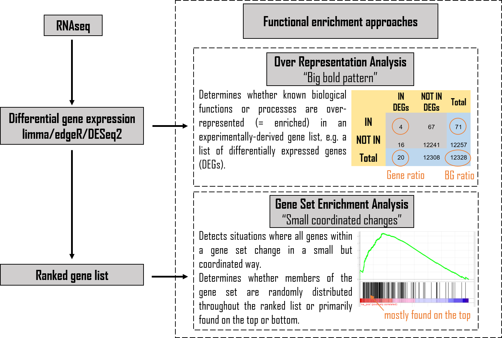

```{r, message=FALSE, warning=FALSE}
library(tidyverse) # used for data manipulation
library(rmarkdown) # used for paged_table function
```

# Information
The notebook contains: Proteomics data of DARS2-deficient and WT intestinal epithelial cell (IECs) that were analysed by MS-based proteome analysis. Proteomics data acquisition has been performed by the Krüger Lab, CECAD Research Center, Faculty of Medicine, University Hospital Cologne, Germany. Input data for this notebook will be available upon publication in the folder "InputData/Proteomics".\
\
Code for the R analysis can be reproduced by following this notebook. This includes GSEA, ORA and all subsequent plots.

# The Input data
Input data including the LFQ values and the results of  the differential expression analysis was provided by Theresa Bock, Krüger Lab, CECAD Research Center, Faculty of Medicine, University Hospital Cologne, Germany.
```{r, message=FALSE, warning=FALSE}
TGvWT <- read.csv("InputData/Proteomics/20210328_proteinGroups_TB.csv", check.names=FALSE)
```

# Quality Control
## Remove duplicated gene names
We remove duplicated gene names. This will include NA or empty spaces, which both can occur when protein IDs have no corresponding gene name assigned.\
If a gene name was duplicated the entry with the greatest Log2FC is kept.

```{r, message=FALSE, warning=FALSE}
#Remove duplicated genes: Function 
RemoveDublons <-function(MyData){
  MyData <- MyData[complete.cases(MyData),]
  print("Number of genes in CS_DESeq_TvWT.csv dataset:")
  print(nrow(MyData))
  doublons <- as.character(MyData[duplicated(MyData$Gene),"Gene"])
  # Keep the entry with the greatest Log2FC:
  MyData$absLogFC <- abs(MyData$log2FoldChange)
  MyData <- MyData[ order(MyData$absLogFC), ]
  MyData_Select <- MyData[!duplicated(MyData$Gene),]
  print("Number of genes after removing duplicated gene names from dataset:")
  print(nrow(MyData_Select))
  #Safe:
  OutputFileName <-  MyData_Select
}

TGvWT_ND <- RemoveDublons(MyData= TGvWT)
```

## PCA plots
Principal component analysis (PCA) to chck the sample clustering. For this the LFQ-values were used.\
```{r, message=FALSE, warning=FALSE}
#Prepare Data matrix
PCA_Data <- TGvWT_ND
rownames(PCA_Data) <- PCA_Data$Gene
PCA_Data_Matrix <- t(PCA_Data[,10:29])
PCA_Data_Matrix <- cbind(rownames(PCA_Data_Matrix), data.frame(PCA_Data_Matrix, row.names=NULL))
PCA_Data_Matrix <- PCA_Data_Matrix %>%
  separate("rownames(PCA_Data_Matrix)", into= c("X","class" ,"Sample"), sep="_", remove=FALSE) 
rownames(PCA_Data_Matrix)<-PCA_Data_Matrix$Sample

#Establish function:
library(devtools)
library(ggfortify)
library(ggplot2)
PCA_class <- function(InputMatrix,InputData,OutputPlotName){
  PCA_Sample <- autoplot (prcomp(InputMatrix),
         data= InputData,
         colour = "class", #colour = row including the sample information to colour code
         #label=T,
         #label.size=3,
         #label.repel = TRUE,
         #loadings=T, #draws Eigenvectors
         #loadings.label = TRUE,
         #loadings.label.vjust = 1.2,
         #loadings.label.size=2,
         #loadings.colour="grey10",
         #loadings.label.colour="grey10",
         color = "black",#outline colour
         fill = "class",#fill colour of the dots ("cyan4")
         alpha = 0.3,#controls the transparency: 1 = 100% opaque; 0 = 100% transparent.
         shape = 21,#https://rpkgs.datanovia.com/ggpubr/reference/show_point_shapes.html
         size = 8#size of the dot
         )+
    theme_classic()+
    geom_hline(yintercept=0, linetype="dashed", color = "black", alpha=0.6, size=0.75)+
    geom_vline(xintercept = 0, linetype="dashed", color = "black", alpha=0.6, size=0.75)+
    ggtitle(paste(OutputPlotName), subtitle = "PCA color = Sample" )
  ggsave(file=paste("Figures/Proteomics/PCA_ColorSample", OutputPlotName, ".pdf", sep="_"), plot=PCA_Sample, width=7, height=6)
  plot(PCA_Sample)
}

#Plots:
PCA_class(InputMatrix = PCA_Data_Matrix[,-c(1:4)],InputData= PCA_Data_Matrix, OutputPlotName = "D7_TGvWT")
```

## Volcano Plot: Overview
Get an overview over the protein landscape and the distribution of the changes.
```{r, warning= FALSE, message=FALSE}
library(ggrepel)
library(EnhancedVolcano)

VolcanoPlot4<- EnhancedVolcano (TGvWT_ND,
                lab = TGvWT_ND$Gene,#Metabolite name
                x = "log2FoldChange",#Log2FC
                y = "padj",#p-value or q-value
                xlab = bquote(~Log[2]~ "FC"),
                ylab = bquote(~-Log[10]~p.adj),#(~-Log[10]~adjusted~italic(P))
                pCutoff = 0.05,
                FCcutoff = 0.5,#Cut off Log2FC, automatically 2
                pointSize = 4,
                labSize = 1,
                titleLabSize = 16,
                col=c("darkseagreen3", "mediumaquamarine", "mediumaquamarine", "cyan4"),
                colAlpha = 0.5,
                title="D7_TGvWT_ND",
                subtitle = bquote(italic("Proteomics")),
                caption = paste0("total = ", nrow(TGvWT_ND), " Genes"),
                #xlim = c(-3.5,2.5),
                ylim = c(0,6.5),
                #drawConnectors = TRUE,
                #widthConnectors = 0.5,
                #colConnectors = "black",
                cutoffLineType = "dashed",
                cutoffLineCol = "black",
                cutoffLineWidth = 0.5,
                #legendLabels=c('No changes',"-0.5< Log2FC <0.5","-0.5< Log2FC <0.5", 'p.adj<0.05 & -0.5< Log2FC <0.5"'),
                legendPosition = 'right',
                legendLabSize = -1,
                legendIconSize = -1
                )
ggsave("Figures/Proteomics/VolcanoPlot_Overview_TGvWT.pdf", plot=VolcanoPlot4, width=10, height=8)

plot(VolcanoPlot4)

#Select labels:
VolcanoPlot3<- EnhancedVolcano (TGvWT_ND,
                lab = TGvWT_ND$Gene,#Metabolite name
                selectLab = c("Fabp2", "Fasn", "Plin2", "Tgn38", "Apoa4", "Apoa1", "Mttp", "Lsr"),
                x = "log2FoldChange",#Log2FC
                y = "padj",#p-value or q-value
                xlab = bquote(~Log[2]~ "FC"),
                ylab = bquote(~-Log[10]~p.adj),#(~-Log[10]~adjusted~italic(P))
                pCutoff = 0.05,
                FCcutoff = 0.5,#Cut off Log2FC, automatically 2
                pointSize = 4,
                labSize = 3,
                titleLabSize = 16,
                col=c("darkseagreen3", "mediumaquamarine", "mediumaquamarine", "cyan4"),
                colAlpha = 0.5,
                title="D7_TGvWT_ND",
                subtitle = bquote(italic("Proteomics")),
                caption = paste0("total = ", nrow(TGvWT_ND), " Genes"),
                #xlim = c(-3.5,2.5),
                ylim = c(0,6.5),
                drawConnectors = TRUE,
                widthConnectors = 0.5,
                colConnectors = "black",
                cutoffLineType = "dashed",
                cutoffLineCol = "black",
                cutoffLineWidth = 0.5,
                #legendLabels=c('No changes',"-0.5< Log2FC <0.5","-0.5< Log2FC <0.5", 'p.adj<0.05 & -0.5< Log2FC <0.5"'),
                legendPosition = 'right',
                legendLabSize = -1,
                legendIconSize = -1
                )
ggsave("Figures/Proteomics/VolcanoPlot_Overview_TGvWT_LabSelect.pdf", plot=VolcanoPlot3, width=10, height=8)

plot(VolcanoPlot3)
```

## Mitochondria complex expression
Given that the ablation of DARS2 impacts on mitochondrial translation, we checked the protein expression of the mitochondrial electron transport chain.\
To extract all mitochondria complexes we used the list curated in [Petros et. al](https://www.cell.com/cell-reports/comments/S2211-1247(17)31412-2).\
Complexes that have not been detected were removed.

```{r, message=FALSE, warning=FALSE}
#Prepare DF:
Complexes <- read.csv("InputData/Proteomics/Petros et al_Mouse-ETC-Complexes.csv", check.names=FALSE)
Complexes_Prot <- merge(x=Complexes,y=TGvWT_ND[,c(3,8:9,65)], by.x="Symbol", by.y="Gene", all.x=TRUE)%>%
    subset(log2FoldChange!="NA")
Complexes_Prot$pval <- 10^-(Complexes_Prot$`-Log10 p-value TG/WT`)

#Prepare new colour scheme:
  keyvals <- ifelse(
    Complexes_Prot$Complex == "Complex_I", "blue",
    ifelse(Complexes_Prot$Complex == "Complex_II", "gold4",
    ifelse(Complexes_Prot$Complex == "Complex_III", "deeppink4",
    ifelse(Complexes_Prot$Complex == "Complex_IV", "seagreen4",
    ifelse(Complexes_Prot$Complex == "Complex_V", "cyan4",
    ifelse(Complexes_Prot$Complex == "Cytochrome_C", "pink",
           "black"))))))
  keyvals[is.na(keyvals)] <- 'black'
  names(keyvals)[keyvals == 'blue'] <- "Complex_I"
  names(keyvals)[keyvals == 'gold4'] <- "Complex_II"
  names(keyvals)[keyvals == 'deeppink4'] <- "Complex_III"
  names(keyvals)[keyvals == 'seagreen4'] <- "Complex_IV"
  names(keyvals)[keyvals == 'cyan4'] <- "Complex_V"
  names(keyvals)[keyvals == 'pink'] <- "Cytochrome_C"
  names(keyvals)[keyvals == 'black'] <- 'X'

keyvals.shape <- ifelse(
    Complexes_Prot$Encoded == "Mitochondria", 18,
      ifelse(Complexes_Prot$Encoded == "Nucleus", 19,
        3))
keyvals.shape[is.na(keyvals.shape)] <- 3
  names(keyvals.shape)[keyvals.shape == 3] <- 'NA'
  names(keyvals.shape)[keyvals.shape == 18] <- 'Mitochondria encoded gene'
  names(keyvals.shape)[keyvals.shape == 19] <- 'Nuclear encoded gene'

#Make the VolcanoPlot
VolcanoPlot<- EnhancedVolcano (Complexes_Prot,
                lab = Complexes_Prot$Symbol,#Metabolite name
                x = "log2FoldChange",#Log2FC
                y = "padj",#p-value or q-value
                xlab = bquote(~Log[2]~ "FC"),
                ylab = bquote(~-Log[10]~p.adj),#(~-Log[10]~adjusted~italic(P))
                pCutoff = 0.05,
                FCcutoff = 0.5,#Cut off Log2FC, automatically 2
                pointSize = 4,
                labSize = 2,
                titleLabSize = 16,
                shapeCustom = keyvals.shape,
                colCustom = keyvals,
                colAlpha = 0.5,
                title="D8_TGvWT",
                subtitle = bquote(italic("Genes of the mitochondrial Complexes")),
                caption = paste0("total = ", nrow(Complexes_Prot), " genes of the mitochondrial Complexes"),
                xlim = c(-8,4),
                ylim = c(0,7),
                #drawConnectors = TRUE,
                #widthConnectors = 0.5,
                #colConnectors = "black",
                #arrowheads=FALSE,
                cutoffLineType = "dashed",
                cutoffLineCol = "black",
                cutoffLineWidth = 0.5,
                #legendLabels=c('No changes',"-0.5< Log2FC <0.5","-0.5< Log2FC <0.5", 'p.adj<0.05 & -0.5< Log2FC <0.5"'),
                legendPosition = 'right',
                legendLabSize = 8,
                legendIconSize =4
                )
ggsave("Figures/Proteomics/VolcanoPlot_mt-Complexes_TGvWT.pdf", plot=VolcanoPlot, width=10, height=8)
plot(VolcanoPlot)


VolcanoPlot1<- EnhancedVolcano (Complexes_Prot,
                lab = Complexes_Prot$Symbol,#Metabolite name
                selectLab = c('mt-Atp6','mt-Atp8','mt-Co1',"mt-Co2","mt-Co3",'mt-Cyb','mt-Nd1','mt-Nd2','mt-Nd3','mt-Nd4','mt-Nd4l','mt-Nd5','mt-Nd6'),
                x = "log2FoldChange",#Log2FC
                y = "padj",#p-value or q-value
                xlab = bquote(~Log[2]~ "FC"),
                ylab = bquote(~-Log[10]~p.adj),#(~-Log[10]~adjusted~italic(P))
                pCutoff = 0.05,
                FCcutoff = 0.5,#Cut off Log2FC, automatically 2
                pointSize = 4,
                labSize = 3,
                labFace="bold",
                #boxedLabels = TRUE,
                titleLabSize = 16,
                shapeCustom = keyvals.shape,
                colCustom = keyvals,
                colAlpha = 0.5,
                title="D8_TGvWT",
                subtitle = bquote(italic("Genes of the mitochondrial Complexes")),
                caption = paste0("total = ", nrow(Complexes_Prot), " genes of the mitochondrial Complexes"),
                xlim = c(-8,4),
                ylim = c(0,7),
                drawConnectors = TRUE,
                widthConnectors = 1,
                colConnectors = "black",
                #labhjust = 1,
                #labvjust = 0.5,
                #arrowheads=FALSE,
                cutoffLineType = "dashed",
                cutoffLineCol = "black",
                cutoffLineWidth = 0.5,
                #legendLabels=c('No changes',"-0.5< Log2FC <0.5","-0.5< Log2FC <0.5", 'p.adj<0.05 & -0.5< Log2FC <0.5"'),
                legendPosition = 'right',
                legendLabSize = 8,
                legendIconSize =4
                )
ggsave("Figures/Proteomics/VolcanoPlot_mt-Complexes_TGvWT_LabelSelect.pdf", plot=VolcanoPlot1, width=10, height=8)
plot(VolcanoPlot1)
```

# Gene set enrichment (GSE)
To find dysregulated groups of genes, bioinformatic tools have been developed to perform differential expression analysis between e.g. tumour and healthy tissue and subsequent gene set enrichment (GSE) methods. Gene set collections are collections of biological pathways or molecular network information about a biological system, such as the Molecular signatures database (MsigDB).This gene set collection extracted signatures from original research publications and imports entire collections such as Gene ontology (GO), a hierarchy of controlled terms to describe individual. Performing GSE methods using these gene sets reduces the data to smaller, more interpretable sets of altered signalling pathways or processes.\
\
Here we use two different forms of GSE:\
\


## ORA
Here we analyse the enrichment of genes of two subgroups:\
1.padj < 0.05 & log2FoldChange > 0.5\
2.padj < 0.05 & log2FoldChange < -0.5\
\
For the ORA analysis the [clusterProfiler package](https://bioconductor.org/packages/release/bioc/html/clusterProfiler.html) is used including the GO-term pathways. A nice summary of the terminology and the principles behind this analysis can be found [here](http://yulab-smu.top/clusterProfiler-book/chapter1.html#terminology).\
The visualization was done using [enrichplot](https://www.bioconductor.org/packages/devel/bioc/manuals/enrichplot/man/enrichplot.pdf)\
Prior to running the analysis, we had to map the mouse ensembl numbers to mouse entrez ids. This was done using [scibiomart](https://github.com/ArianeMora/scibiomart/tree/1.0.0), which is based on [biomaRt](https://www.bioconductor.org/packages/release/bioc/vignettes/biomaRt/inst/doc/biomaRt.html).\
```{r, message=FALSE, warning=FALSE}
#https://www.bioconductor.org/packages/devel/bioc/manuals/enrichplot/man/enrichplot.pdf
#http://bioconductor.org/packages/release/bioc/html/enrichplot.html
#Install and download the package
library(reticulate)
#py_install("scibiomart", pip = TRUE)# install scibiomart
scibiomart <- import("scibiomart")# import scibiomart

sb <- scibiomart$SciBiomart()
sb$set_mart('ENSEMBL_MART_ENSEMBL')
sb$set_dataset('mmusculus_gene_ensembl')
Mouse <- sb$run_query(NULL, c('ensembl_gene_id', 'external_gene_name', 'entrezgene_id'))

#The column "external_gene_id" and "entrezgene_id" are a list, so we have to unlist
Mouse <- Mouse %>%
  unnest(c(external_gene_name, entrezgene_id))
```

```{r, message=FALSE, warning=FALSE}
library(org.Mm.eg.db)#For mouse load:
library(clusterProfiler)#To run ORA
library(enrichplot)#For emapplot, dotplot,...
library(ggplot2)#For safing and legends

#Prepare the Universe and Gene set to test:
print("Number of genes in the TGvWT dataset:")
print(nrow(TGvWT_ND))

df <- merge(x = TGvWT_ND, y = Mouse, by.x='Gene', by.y='external_gene_name', all.x = TRUE)
df <- df%>%
  subset(entrezgene_id!="NULL")%>%
  subset(entrezgene_id!="NA")
print("Number of genes with entrezgene_id in the TGvWT dataset:")
print(nrow(df))

allGenes <- as.character(df$entrezgene_id)

clusterGenes_Pos <- subset(df, padj < 0.05 & log2FoldChange > 0.5, select="entrezgene_id")
print("Number of genes with entrezgene_id in the TGvWT dataset with padj < 0.05 & log2FoldChange > 0.5:")
print(nrow(clusterGenes_Pos))

clusterGenes_Neg <- subset(df, padj < 0.05 & log2FoldChange < -0.5, select="entrezgene_id")
print("Number of genes with entrezgene_id in the TGvWT dataset with padj < 0.05 & log2FoldChange < -0.5:")
print(nrow(clusterGenes_Neg))

#Run the ORA:
clusterGo_Pos <- enrichGO(gene = unlist(clusterGenes_Pos), 
                  universe = allGenes,
                  keyType = "ENTREZID",
                  OrgDb = org.Mm.eg.db, 
                  ont = "ALL",
                  pAdjustMethod = "BH", 
                  qvalueCutoff = 0.1, 
                  readable = TRUE)
clusterGoSummary_Pos <- data.frame(clusterGo_Pos)
write_csv(clusterGoSummary_Pos, "OutputData/Proteomics/ORA_Log2FCbg0.5_padj0.05_TGvWT.csv")

clusterGo_Neg <- enrichGO(gene = unlist(clusterGenes_Neg), 
                  universe = allGenes,
                  keyType = "ENTREZID",
                  OrgDb = org.Mm.eg.db, 
                  ont = "ALL",
                  pAdjustMethod = "BH", 
                  qvalueCutoff = 0.1, 
                  readable = TRUE)
clusterGoSummary_Neg <- data.frame(clusterGo_Neg)
write_csv(clusterGoSummary_Neg, "OutputData/Proteomics/ORA_Log2FCsm-0.5_padj0.05_TGvWT.csv")

#-------------------------
#Make the Plots:
##POSITIVE
x1 <- pairwise_termsim(clusterGo_Pos)
Emapplot<- emapplot(x1, pie_scale=1,showCategory=50, layout = "nicely", cex_label_category=0.4, min_edge=0.2)+ ggtitle("TGvWT: Log2FC>0.5 & p.adj<0.05")
ggsave("Figures/Proteomics/Emapplot_Log2FCbg0.5_padj0.05_TGvWT_Top50.pdf", plot=Emapplot, width=10, height=8)
plot(Emapplot)

Emapplot1<- emapplot(x1, pie_scale=1,showCategory=40, layout = "nicely", cex_label_category=0.4, min_edge=0.2)+ ggtitle("TGvWT: Log2FC>0.5 & p.adj<0.05")
ggsave("Figures/Proteomics/Emapplot_Log2FCbg0.5_padj0.05_D7-TGvWT_Top40.pdf", plot=Emapplot1, width=10, height=8)
plot(Emapplot1)

Dotplot <- dotplot(clusterGo_Pos, showCategory=50) + ggtitle("TGvWT: Log2FC>0.5 & p.adj<0.05")+ theme(axis.text.x =element_text(size=8,face="bold"), axis.text.y =element_text(size=8,face="bold"), axis.title=element_text(size=5))
ggsave("Figures/Proteomics/Dotplot_Log2FCbg0.5_padj0.05_TGvWT.pdf", plot=Dotplot, width=10, height=8)
plot(Dotplot)#https://github.com/YuLab-SMU/enrichplot/issues/22

Heatplot <- heatplot(clusterGo_Pos,showCategory=50) + theme(axis.text.x =element_text(size=2),
        axis.text.y =element_text(size=5,face="bold"), axis.title=element_text(size=12,face="bold")) +ggtitle("TGvWT: Log2FC>0.5 & p.adj<0.05")
ggsave("Figures/Proteomics/Heatplot_Log2FCbg0.5_padj0.05_TGvWT.pdf", plot=Heatplot, width=14, height=8)
plot(Heatplot)

##NEGATIVE:
x2 <- pairwise_termsim(clusterGo_Neg)
Emapplot2<- emapplot(x2,pie_scale=1, showCategory=50, layout = "nicely", cex_label_category=0.4, min_edge=0.2)+ ggtitle("TGvWT: Log2FC<-0.5 & p.adj<0.05")
ggsave("Figures/Proteomics/Emapplot_Log2FCsm-0.5_padj0.05_TGvWT_Top50.pdf", plot=Emapplot2, width=10, height=8)
plot(Emapplot2)

Emapplot3<- emapplot(x2,pie_scale=1, showCategory=40, layout = "nicely", cex_label_category=0.4, min_edge=0.2)+ ggtitle("TGvWT: Log2FC<-0.5 & p.adj<0.05")
ggsave("Figures/Proteomics/Emapplot_Log2FCsm-0.5_padj0.05_TGvWT_Top40.pdf", plot=Emapplot3, width=10, height=8)
plot(Emapplot3)

Dotplot1 <- dotplot(clusterGo_Neg, showCategory=50) + ggtitle("TGvWT: Log2FC<-0.5 & p.adj<0.05")+ theme(axis.text.x =element_text(size=8,face="bold"), axis.text.y =element_text(size=8,face="bold"), axis.title=element_text(size=5))
ggsave("Figures/Proteomics/Dotplot_Log2FCsm-0.5_padj0.05_TGvWT.pdf", plot=Dotplot1, width=10, height=8)
plot(Dotplot1)

Heatplot1 <- heatplot(clusterGo_Neg,showCategory=50) + theme(axis.text.x =element_text(size=2),
        axis.text.y =element_text(size=5,face="bold"), axis.title=element_text(size=12,face="bold")) +ggtitle("TGvWT: Log2FC<-0.5 & p.adj<0.05")
ggsave("Figures/Proteomics/Heatplot_Log2FCsm-0.5_padj0.05_TGvWT.pdf", plot=Heatplot1, width=14, height=8)
plot(Heatplot1)
```

## GSEA - MsigDB
We run the GSEA analysis using the t-value of the DESeq2 results for ranking.\
First we downloaded the signatures of interest from the [MsigDB](http://software.broadinstitute.org/gsea/msigdb) including "KEGG", "Reactome", "Biocarta", "Hallmarks", "GO_BP", "GO_CC", "GO_MF". In order to be able to compare the results of the different signatures of interest, we combined the signatures and run them together:\
1. "KEGG", "Reactome", "Biocarta", "Hallmarks", ATF4_HAN (For the classical signature of ISR and direct ATF4 targets [this paper](https://www.nature.com/articles/ncb2738.pdf) was used as a database. Here they have performed Chip-Seq using ATF4 and CHOP and we downloaded the supplementary table S1 and used the ATF4 target genes including the once that overlapped with CHOP target genes (254 ATF4 only target genes & 218 ATF4 and CHOP target genes))
2. "GO_BP", "GO_CC", "GO_MF"\
\
Since all these signatures are based on human genes, we translated them into mouse gene names. Of course some human genes are not conserved in mouse (and the other way around) and hence the signatures may become smaller.\
This was done using [scibiomart](https://github.com/ArianeMora/scibiomart/tree/1.0.0), which is based on [biomaRt](https://www.bioconductor.org/packages/release/bioc/vignettes/biomaRt/inst/doc/biomaRt.html).

```{r, message=FALSE, warning=FALSE}
#Install and download the package
library(reticulate)
#py_install("scibiomart", pip = TRUE)# install scibiomart
scibiomart <- import("scibiomart")# import scibiomart

# Get the mapping to gene IDs
sb <- scibiomart$SciBiomart()
sb$set_mart('ENSEMBL_MART_ENSEMBL')
sb$set_dataset('hsapiens_gene_ensembl')
Hum_to_Mus <- sb$run_query(NULL, c('ensembl_gene_id', 'external_gene_name', 'mmusculus_homolog_ensembl_gene'))
Hum_to_Mus <- Hum_to_Mus %>%
  unnest(c(external_gene_name, mmusculus_homolog_ensembl_gene))

#Prepare the pathway file needed to run the GSEA:
##Function to map the pathways to the mouse genes:
library(fgsea)
library(GSEABase)
Hum_Mus_Gene <-function(GMT_File, MappingList){
  InputPathway <- gmt_to_csv(GMT_File)
  print("Genes in InputPathway")
  print(GMT_File)
  print(nrow(InputPathway))
  Pathway <- merge(x = InputPathway, y = MappingList, by.x='gene', by.y='external_gene_name', all.x = TRUE)
  Pathway_M <- Pathway[,c(4,2)]%>%
    subset(mmusculus_homolog_ensembl_gene!="NULL")%>%
    subset(mmusculus_homolog_ensembl_gene!="NA")%>%
    unite(Unique_ID, c("mmusculus_homolog_ensembl_gene", "term"), remove = FALSE)
  names(Pathway_M )[names(Pathway_M ) == "mmusculus_homolog_ensembl_gene"] <- "gene"#Rename the rowname
    Pathway_M <- Pathway_M[!duplicated(Pathway_M$Unique_ID),]
    Pathway_M <- Pathway_M[,-1]
  print("Genes in InputPathway translated to mouse:")
  print(nrow(Pathway_M))
  Output <- Pathway_M
}
gmt_to_csv <- function(gmtfile, fast = T) #credit to Aurélien Dugourd
{
  if(fast)
  {
    genesets = GSEABase::getGmt(con = gmtfile)
    genesets = unlist(genesets)
    
    gene_to_term =plyr::ldply(genesets,function(geneset){
      temp <- geneIds(geneset)
      temp2 <- setName(geneset)
      temp3 <- as.data.frame(cbind(temp,rep(temp2,length(temp))))
      
    },.progress = plyr::progress_text())
    names(gene_to_term) <- c("gene","term")
    return(gene_to_term[complete.cases(gene_to_term),])
  }
  else
  {
    genesets = getGmt(con = gmtfile)
    genesets = unlist(genesets)
    
    gene_to_term <- data.frame(NA,NA)
    names(gene_to_term) <- c("gene","term")
    for (geneset in genesets)
    {
      temp <- geneIds(geneset)
      temp2 <- setName(geneset)
      temp3 <- as.data.frame(cbind(temp,rep(temp2,length(temp))))
      names(temp3) <- c("gene","term")
      gene_to_term <- rbind(gene_to_term,temp3)
    }
    
    return(gene_to_term[complete.cases(gene_to_term),])
  }
}

KEGG <- Hum_Mus_Gene(GMT_File="InputData/Signatures_for_GSEA/c2.cp.kegg.v6.2.symbols.gmt", MappingList=Hum_to_Mus)
Reactome <- Hum_Mus_Gene(GMT_File="InputData/Signatures_for_GSEA/c2.cp.reactome.v6.2.symbols.gmt", MappingList=Hum_to_Mus)
Biocarta <- Hum_Mus_Gene(GMT_File="InputData/Signatures_for_GSEA/c2.cp.biocarta.v6.2.symbols.gmt", MappingList=Hum_to_Mus)
Hallmarks <- Hum_Mus_Gene(GMT_File="InputData/Signatures_for_GSEA/h.all.v6.2.symbols.gmt", MappingList=Hum_to_Mus)

GO_BP <- Hum_Mus_Gene(GMT_File="InputData/Signatures_for_GSEA/c5.go.bp.v7.2.symbols.gmt", MappingList=Hum_to_Mus)%>%
  separate(col=term, into = c("GO", "Rest"), sep="GO_", remove=TRUE)%>%
  add_column(GO_term="GO_BP")%>%
  unite(col="term",c("GO_term", "Rest"), sep="_")
GO_BP <-GO_BP[,-2]
GO_CC <- Hum_Mus_Gene(GMT_File="InputData/Signatures_for_GSEA/c5.go.cc.v7.2.symbols.gmt", MappingList=Hum_to_Mus)%>%
  separate(col=term, into = c("GO", "Rest"), sep="GO_", remove=TRUE)%>%
  add_column(GO_term="GO_CC")%>%
  unite(col="term",c("GO_term", "Rest"), sep="_")
GO_CC <-GO_CC[,-2]
GO_MF <- Hum_Mus_Gene(GMT_File="InputData/Signatures_for_GSEA/c5.go.mf.v7.2.symbols.gmt", MappingList=Hum_to_Mus)%>%
  separate(col=term, into = c("GO", "Rest"), sep="GO_", remove=TRUE)%>%
  add_column(GO_term="GO_MF")%>%
  unite(col="term",c("GO_term", "Rest"), sep="_")
GO_MF <-GO_MF[,-2]

#Prepare the file we need for the ATF4 signatures:
ATF4_Han <- read.csv("InputData/Signatures_for_GSEA/41556_2013_BFncb2738_MOESM48_ESM (1).csv")
ATF4_Han$term <- "ATF4_Han"
ATF4_Han <- ATF4_Han[,c(2,11)]#map to ensmus!
Pathway <- merge(x = ATF4_Han, y =Mouse, by.x='Symbol', by.y='external_gene_name', all.x = TRUE)
print(nrow(ATF4_Han))
Pathway_M <- Pathway[,c(3,2)]%>%
    subset(ensembl_gene_id!="NULL")%>%
    subset(ensembl_gene_id!="NA")%>%
    unite(Unique_ID, c("ensembl_gene_id", "term"), remove = FALSE)
names(Pathway_M )[names(Pathway_M ) == "ensembl_gene_id"] <- "gene"#Rename the rowname
    Pathway_M <- Pathway_M[!duplicated(Pathway_M$Unique_ID),]
    Pathway_M <- Pathway_M[,-1]
  print("Genes in InputPathway translated to mouse:")
  print(nrow(Pathway_M))
ATF4_Han <- Pathway_M
```

1. "KEGG", "Reactome", "Biocarta", "Hallmarks", "ATF4":\
```{r, warning= FALSE, message=FALSE}
#Load DF with EnterezIDs
GSEA_ND <- df

#Establish function
DoGSEA_1 <- function(InputData, OutputfileName){
  #Prepare data matrix for GSEA:
  Column_Gene <- as.character(InputData$ensembl)#Ensembl name
  Column_tval <- as.numeric(InputData$Stat)
  MyData_Extracted <- data.frame(cbind(Column_Gene, Column_tval), stringsAsFactors = F)
  MyData_Extracted$Column_tval <- as.numeric(MyData_Extracted$Column_tval)
  t_val <- as.numeric(MyData_Extracted$Column_tval)#Make the data into a vector
  names(t_val) <- MyData_Extracted$Column_Gene
  #Run the GSEA analysis
  ##1."KEGG", "Reactome", "Biocarta", "Hallmarks"
  pathways <- rbind(KEGG, Reactome, Biocarta, Hallmarks, ATF4_Han)
  pathway_list <- list()
  for(pathway in unique(pathways$term))
  {pathway_list[[pathway]] <- as.character(pathways[pathways$term == pathway, 1])}
  gsea_result1 <- fgsea(pathways = pathway_list, stats = t_val, nperm = 1000)
  write_csv(gsea_result1[,c(-8)], file=paste("OutputData/Proteomics/GSEA_result_KEGG-Hallmark-Reactome-Biocarta-ATF4", OutputfileName, ".csv", sep="_"))
  Output1 <- gsea_result1
  ##Plot
  Volcano1 <- separate(gsea_result1,"pathway", into = c("signature", "rest"), sep= "_", remove=FALSE)%>% 
    mutate(colour = case_when(signature =="KEGG" ~ 'blue',
                              signature =="BIOCARTA" ~ 'gold4',
                              signature =="HALLMARK" ~ 'deeppink4',
                              signature =="REACTOME" ~ 'seagreen4',
                              signature =="ATF4" ~ 'pink',
                                  TRUE ~ 'Not_Detected'))
  keyvals <- ifelse(
    Volcano1$colour == "blue", "blue",
    ifelse(Volcano1$colour == "gold4", "gold4",
    ifelse(Volcano1$colour == "deeppink4", "deeppink4",
    ifelse(Volcano1$colour == "seagreen4", "seagreen4",
    ifelse(Volcano1$colour == "pink", "pink",
           "black")))))
  keyvals[is.na(keyvals)] <- 'black'
  names(keyvals)[keyvals == 'blue'] <- "KEGG"
  names(keyvals)[keyvals == 'gold4'] <- "BIOCARTA"
  names(keyvals)[keyvals == 'deeppink4'] <- "HALLMARK"
  names(keyvals)[keyvals == 'seagreen4'] <- "REACTOME"
  names(keyvals)[keyvals == 'pink'] <- "ATF4"
    names(keyvals)[keyvals == 'black'] <- 'X'
  VolcanoPlot <- EnhancedVolcano (Volcano1,
                lab = Volcano1$pathway,#Metabolite name
                x = "NES",#Log2FC
                y = "padj",#p-value or q-value
                xlab = "NES",
                ylab = bquote(~-Log[10]~p.adj),#(~-Log[10]~adjusted~italic(P))
                pCutoff = 0.25,
                FCcutoff = 0.5,#Cut off Log2FC, automatically 2
                pointSize = 3,
                labSize = 1,
                colCustom = keyvals,
                titleLabSize = 16,
                col=c("black", "grey", "grey", "purple"),#if you want to change colors
                colAlpha = 0.5,
                title=paste(OutputfileName),
                subtitle = bquote(italic("GSEA")),
                caption = paste0("total = ", (nrow(Volcano1)), " Pathways"),
                #xlim = c(-3.5,2.5),
                #ylim = c(0,1.5),
                ylim = c(0,((-log10(Reduce(min,Volcano1$padj))))+0.05),
                #drawConnectors = TRUE,
                #widthConnectors = 0.5,
                #colConnectors = "black",
                cutoffLineType = "dashed",
                cutoffLineCol = "black",
                cutoffLineWidth = 0.5,
                legendLabels=c('No changes',"-0.5< NES <0.5", 'p.adj<0.25 & -0.5< NES <0.5"'),
                legendPosition = 'right',
                legendLabSize = 12,
                legendIconSize = 5.0
                )
  ggsave(file=paste("Figures/Proteomics/VolcanoPlot_GSEA_KEGG-Hallmark-Reactome-Biocarta-ATF4", OutputfileName, ".pdf", sep="_"), plot=VolcanoPlot, width=10, height=8)
  plot(VolcanoPlot)
  #Selected Signatures:
  VolcanoPlot1 <- EnhancedVolcano (Volcano1,
                lab = Volcano1$pathway,#Metabolite name
                x = "NES",#Log2FC
                y = "padj",#p-value or q-value
                xlab = "NES",
                ylab = bquote(~-Log[10]~p.adj),#(~-Log[10]~adjusted~italic(P))
                selectLab = c("KEGG_OXIDATIVE_PHOSPHORYLATION","HALLMARK_OXIDATIVE_PHOSPHORYLATION","REACTOME_RESPIRATORY_ELECTRON_TRANSPORT","REACTOME_TCA_CYCLE_AND_RESPIRATORY_ELECTRON_TRANSPORT", "HALLMARK_UNFOLDED_PROTEIN_RESPONSE", "REACTOME_MITOCHONDRIAL_PROTEIN_IMPORT", "ATF4_Han", "BIOCARTA_EIF_PATHWAY", "BIOCARTA_EIF2_PATHWAY", "HALLMARK_FATTY_ACID_METABOLISM", "REACTOME_SYNTHESIS_OF_VERY_LONG_CHAIN_FATTY_ACYL_COAS"),
                pCutoff = 0.25,
                FCcutoff = 0.5,#Cut off Log2FC, automatically 2
                pointSize = 3,
                labSize = 1,
                colCustom = keyvals,
                titleLabSize = 16,
                col=c("black", "grey", "grey", "purple"),#if you want to change colors
                colAlpha = 0.5,
                title=paste(OutputfileName),
                subtitle = bquote(italic("GSEA")),
                caption = paste0("total = ", (nrow(Volcano1)), " Pathways"),
                #xlim = c(-3.5,2.5),
                #ylim = c(0,1.5),
                ylim = c(0,((-log10(Reduce(min,Volcano1$padj))))+0.05),
                #drawConnectors = TRUE,
                #widthConnectors = 0.5,
                #colConnectors = "black",
                cutoffLineType = "dashed",
                cutoffLineCol = "black",
                cutoffLineWidth = 0.5,
                legendLabels=c('No changes',"-0.5< NES <0.5", 'p.adj<0.25 & -0.5< NES <0.5"'),
                legendPosition = 'right',
                legendLabSize = 12,
                legendIconSize = 5.0
                )
  ggsave(file=paste("Figures/Proteomics/VolcanoPlot_GSEA_KEGG-Hallmark-Reactome-Biocarta-ATF4_LabSelect", OutputfileName, ".pdf", sep="_"), plot=VolcanoPlot1, width=10, height=8)
  plot(VolcanoPlot1)
}

DoGSEA_1(InputData = GSEA_ND, 
      OutputfileName="TGvWT")
```
\
2. GO-terms:\
```{r, warning= FALSE, message=FALSE}
DoGSEA_2 <- function(InputData, OutputfileName){
  #Prepare data matrix for GSEA:
  Column_Gene <- as.character(InputData$ensembl)#Ensembl name
  Column_tval <- as.numeric(InputData$Stat)
  MyData_Extracted <- data.frame(cbind(Column_Gene, Column_tval), stringsAsFactors = F)
  MyData_Extracted$Column_tval <- as.numeric(MyData_Extracted$Column_tval)
  t_val <- as.numeric(MyData_Extracted$Column_tval)#Make the data into a vector
  names(t_val) <- MyData_Extracted$Column_Gene
  #Run the GSEA analysis
  ##2."GO_BP", "GO_CC", "GO_MF"
  pathways <- rbind(GO_BP, GO_CC, GO_MF)
  pathway_list <- list()
  for(pathway in unique(pathways$term))
  {pathway_list[[pathway]] <- as.character(pathways[pathways$term == pathway, 1])}
  gsea_result2 <- fgsea(pathways = pathway_list, stats = t_val, nperm = 1000)
  write_csv(gsea_result2[,c(-8)], file=paste("OutputData/Proteomics/GSEA_result_GO-terms", OutputfileName, ".csv", sep="_"))
  Output <- gsea_result2
  #Plot
  Volcano2 <- separate(gsea_result2,"pathway", into = c("rest","signature"), sep= "_", remove=FALSE)%>% 
    mutate(colour = case_when(signature =="BP" ~ 'blue',
                              signature =="CC" ~ 'gold4',
                              signature =="MF" ~ 'deeppink4',
                                  TRUE ~ 'Not_Detected'))
  keyvals <- ifelse(
    Volcano2$colour == "blue", "blue",
    ifelse(Volcano2$colour == "gold4", "gold4",
    ifelse(Volcano2$colour == "deeppink4", "deeppink4",
           "black")))
  keyvals[is.na(keyvals)] <- 'black'
  names(keyvals)[keyvals == 'blue'] <- "GO_BP"
  names(keyvals)[keyvals == 'gold4'] <- "GO_CC"
  names(keyvals)[keyvals == 'deeppink4'] <- "GO_MF"
  names(keyvals)[keyvals == 'black'] <- 'X'
  VolcanoPlot <- EnhancedVolcano (Volcano2,
                lab = Volcano2$pathway,#Metabolite name
                x = "NES",#Log2FC
                y = "padj",#p-value or q-value
                xlab = "NES",
                ylab = bquote(~-Log[10]~p.adj),#(~-Log[10]~adjusted~italic(P))
                pCutoff = 0.25,
                FCcutoff = 0.5,#Cut off Log2FC, automatically 2
                pointSize = 3,
                labSize = 1,
                colCustom = keyvals,
                titleLabSize = 16,
                col=c("black", "grey", "grey", "purple"),#if you want to change colors
                colAlpha = 0.5,
                title=paste(OutputfileName),
                subtitle = bquote(italic("GSEA")),
                caption = paste0("total = ", (nrow(Volcano2)), " Pathways"),
                #xlim = c(-3.5,2.5),
                #ylim = c(0,1.5),
                ylim = c(0,((-log10(Reduce(min,Volcano2$padj))))+0.05),
                #drawConnectors = TRUE,
                #widthConnectors = 0.5,
                #colConnectors = "black",
                cutoffLineType = "dashed",
                cutoffLineCol = "black",
                cutoffLineWidth = 0.5,
                legendLabels=c('No changes',"-0.5< NES <0.5", 'p.adj<0.25 & -0.5< NES <0.5"'),
                legendPosition = 'right',
                legendLabSize = 12,
                legendIconSize = 5.0
                )
  ggsave(file=paste("Figures/Proteomics/VolcanoPlot_GSEA_GO-terms", OutputfileName, ".pdf", sep="_"), plot=VolcanoPlot, width=10, height=8)
   plot(VolcanoPlot)
}


DoGSEA_2(InputData = GSEA_ND, 
      OutputfileName="TGvWT")

```

3. Specific Volcano Plots of ATF4 signature:\
```{r, message=FALSE, warning=FALSE}
#Make the DF:
df_Blot_Prot <- merge(x=df,y=Hum_to_Mus, by.x="ensembl_gene_id", by.y="mmusculus_homolog_ensembl_gene", all.x=TRUE)
df_Blot_Prot$pval <- 10^-(df_Blot_Prot$`-Log10 p-value TG/WT`)

#Establish function:
VolcanoPlot_Proteomics <- function(Signature_Merge_Prot, Signature, OutputPlotName, NES, p.adj){
  VolcanoPlot <-EnhancedVolcano (Signature_Merge_Prot,
                lab = Signature_Merge_Prot$Gene,#Metabolite name
                x = "log2FoldChange",#Log2FC
                y = "padj",#p-value or q-value
                xlab = bquote(~Log[2]~ "FC"),
                ylab = bquote(~-Log[10]~p.adj),#(~-Log[10]~adjusted~italic(P))
                pCutoff = 0.05,
                FCcutoff = 0.5,#Cut off Log2FC, automatically 2
                pointSize = 4,
                labSize = 2,
                titleLabSize = 12,
                subtitleLabSize = 8,
                col=c("darkseagreen3", "mediumaquamarine", "mediumaquamarine", "cyan4"),
                colAlpha = 0.5,
                title="Proteomics: D7_TGvWT",
                subtitle = (file=paste("", OutputPlotName, " (NES=", NES, "p.adj.=", p.adj, ")",sep="")),
                caption = paste0("total = ", nrow(Signature_Merge_Prot), " genes of ", nrow(Signature), " genes in pathway"),
                #xlim = c(-3.5,2.5),
                ylim = c(0,6.5),
                #drawConnectors = TRUE,
                #widthConnectors = 0.5,
                #colConnectors = "black",
                cutoffLineType = "dashed",
                cutoffLineCol = "black",
                cutoffLineWidth = 0.5,
                #legendLabels=c('No changes',"-0.5< Log2FC <0.5","-0.5< Log2FC <0.5", 'p.adj<0.05 & -0.5< Log2FC <0.5"'),
                legendPosition = 'right',
                legendLabSize = -1,
                legendIconSize = -1
                )
  ggsave(file=paste("Figures/Proteomics/VolcanoPlot_Proteomics_TGvWT", OutputPlotName, ".pdf", sep="_"), plot=VolcanoPlot, width=10, height=8)
   plot(VolcanoPlot)
}

```

For the classical signature of ISR and direct ATF4 targets [this paper](https://www.nature.com/articles/ncb2738.pdf) is great. In this paper they have performed Chip-Seq using ATF4 and CHOP. I downloaded the supplementary table S1 and used the ATF4 target genes including the once that overlapped with CHOP target genes (254 ATF4 only target genes & 218 ATF4 and CHOP target genes).\
```{r, message=FALSE, warning=FALSE}
Signature <- ATF4_Han
Signature_Merge_Prot <- merge(x=Signature,y=df_Blot_Prot, by.x="gene", by.y="ensembl_gene_id", all.x=TRUE)%>%
  na.omit()

VolcanoPlot_Proteomics(Signature_Merge_Prot=Signature_Merge_Prot, 
                   Signature=Signature, 
                   OutputPlotName="ATF4", 
                   NES="2.36", 
                   p.adj="0.05")#y=6.5

```


# Information about packge used and versions 
```{r, warning= FALSE, message=FALSE}
sessionInfo()
```

 