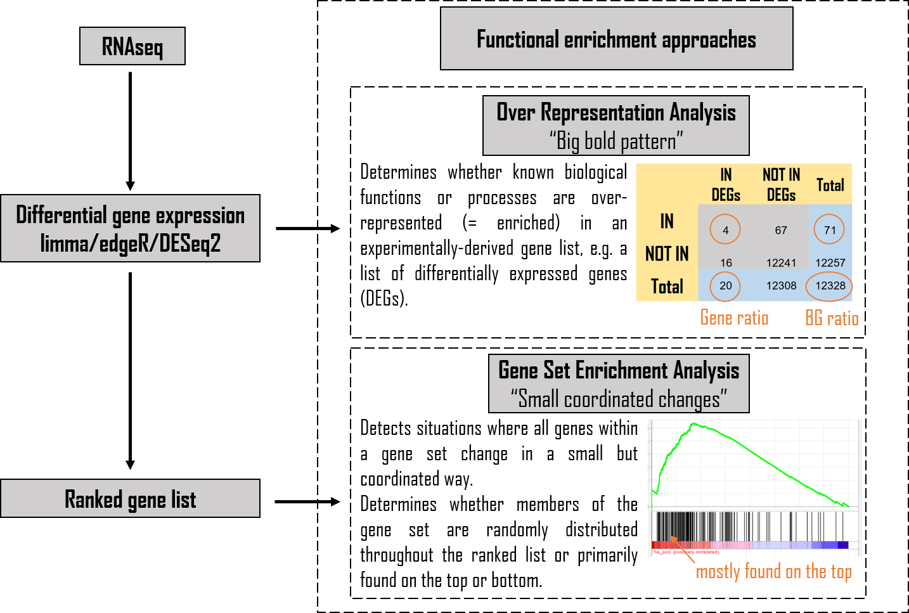

```{r, message=FALSE, warning=FALSE}
library(tidyverse) # used for data manipulation
library(rmarkdown) # used for paged_table function
```

# Information
The notebook contains: 
RNAseq data of  data of total small intestinal proximal tissue from DARS2tamIEC-KO mice. RNAseq data analysis (Read trimming, mapping, counting and DESeq2 analysis) was performed by Ulrike Göbel , CECAD Research Center, Cologne, Germany using R 4.0.0 and Bioconductor version 3.11.\
In detail, read trimming was done using cutadapt version 2.10 to iteratively trim the Illumina Reverse Read2 Sequencing Primer and 3’ polyA runs of length ³18 with the following parameters:\
cutadapt --cores=3 --minimum -length=35 --nextseq -trim=20 --overlap=10 -a AGATCGGAAGAGCACACGTCTGAACTCCAGTCAC [INPUT.fastq.gz]| cutadapt --cores=3 --minimum -length=35 --nextseq -trim=20 --overlap=10 -a'A{18}' -o OUTPUT.fastq.gz-.\
Trimmed reads were mapped to a concatenation of the mouse genome
(Mus_musculus.GRCm38.dna.chromosome.*.fa.gz, downloaded from ftp://ftp.ensembl.org/pub/release-100/fasta/mus_musculus/dna/) and the ERCC92 Spike In sequences (downloaded from https://assets.thermofisher.com/TFS-Assets/LSG/manuals/ERCC92.zip), using subread-align version v2.0.1 with the following parameters:\
-t 0 -d 50 -D 600 --multiMapping -B 5.\
Genomic matches were counted using featureCounts with the following parameters:\
-F "GTF" -t "exon" -g "gene_id" --minOverlap 20 -M --primary -O --fraction -J -Q 30 -T 4.\
The genome annotation used was Mus_musculus.GRCm38.100.gtf (downloaded fromftp://ftp.ensembl.org/pub/release-100/gtf/mus_musculus/), augmented by entries for the ERCC92 Spike Ins.\
\
DESeq2 analysis was performed doing pairwise comparisons between genotypes TG and WT. Genes were excluded from
a DESeq2 run if they had a zero count in more than half of the samples in either of the conditions compared. Note that DESeq2 sets the p-value and the adjusted p-value to NA for genes with too few counts or with extreme outlier counts. Such genes were removed post-analysis from the DESeq2 output. The output tables were augmented by gene symbols and descriptions, derived from Ensembl version 102 using package biomaRt version 2.44.4. In addition, the raw read counts per gene and sample, as returned by featureCounts, were appended to the rows of each output table.\
\
Input data for this notebook will be available upon publication in the folder "InputData/RNASeq".\
\
Code for the R analysis can be reproduced by following this notebook. This includes GSEA, ORA and all subsequent plots.

# The Input data
Input data are the results of the DESeq2 analysis that was provided by Ulrike Göbel , CECAD Research Center, Cologne, Germany.
```{r, message=FALSE, warning=FALSE}
Data_7D <- read.csv("InputData/RNAseq/SP_7Days_differential_expression_DESeq2_tg_VS_wt_Read2_plus_A18.csv", check.names=FALSE)
Data_3D <- read.csv("InputData/RNAseq/SP_3Days_differential_expression_DESeq2_tg_VS_wt_Read2_plus_A18.csv", check.names=FALSE)

```

## Remove duplicated gene names
We remove duplicated gene names. This will include NA or empty spaces, which both can occur when protein IDs have no corresponding gene name assigned.\
If a gene name was duplicated the entry with the greatest Log2FC is kept.

```{r, message=FALSE, warning=FALSE}
#Remove duplicated genes: Function 
RemoveDublons <-function(MyData){
  MyData <- MyData[complete.cases(MyData),]
  print("Number of genes in dataset:")
  print(nrow(MyData))
  doublons <- as.character(MyData[duplicated(MyData$symbol),"symbol"])
  # Keep the entry with the greatest Log2FC:
  MyData$absLogFC <- abs(MyData$log2FoldChange)
  MyData <- MyData[ order(MyData$absLogFC), ]
  MyData_Select <- MyData[!duplicated(MyData$symbol),]
  print("Number of genes after removing duplicated gene names from dataset:")
  print(nrow(MyData_Select))
  #Safe:
  OutputFileName <-  MyData_Select
}

D7_TGvWT_ND <- RemoveDublons(MyData= Data_7D)
D3_TGvWT_ND <- RemoveDublons(MyData= Data_3D)
```

## PCA plots
Principal component analysis (PCA) to check the sample clustering. For this the DESeq2 output values were used.\
```{r, message=FALSE, warning=FALSE}
#Establish function:
library(devtools)
library(ggfortify)
library(ggplot2)
PCA_class <- function(InputMatrix,InputData,OutputPlotName){
  PCA_Sample <- autoplot (prcomp(InputMatrix),
         data= InputData,
         colour = "Genotype", #colour = row including the sample information to colour code
         #label=T,
         #label.size=3,
         #label.repel = TRUE,
         #loadings=T, #draws Eigenvectors
         #loadings.label = TRUE,
         #loadings.label.vjust = 1.2,
         #loadings.label.size=2,
         #loadings.colour="grey10",
         #loadings.label.colour="grey10",
         color = "black",#outline colour
         fill = "Genotype",#fill colour of the dots ("cyan4")
         alpha = 0.3,#controls the transparency: 1 = 100% opaque; 0 = 100% transparent.
         shape = 21,#https://rpkgs.datanovia.com/ggpubr/reference/show_point_shapes.html
         size = 8#size of the dot
         )+
    theme_classic()+
    geom_hline(yintercept=0, linetype="dashed", color = "black", alpha=0.6, size=0.75)+
    geom_vline(xintercept = 0, linetype="dashed", color = "black", alpha=0.6, size=0.75)+
    ggtitle(paste(OutputPlotName), subtitle = "PCA color = Sample" )
  ggsave(file=paste("Figures/RNAseq/PCA_ColorSample", OutputPlotName, ".pdf", sep="_"), plot=PCA_Sample, width=7, height=6)
  plot(PCA_Sample)
}


#Prepare Data matrix and plot:
PCA_Data <- D7_TGvWT_ND
rownames(PCA_Data) <- PCA_Data$symbol
PCA_Data_Matrix <- t(PCA_Data[,7:18])
PCA_Data_Matrix <- cbind(rownames(PCA_Data_Matrix), data.frame(PCA_Data_Matrix, row.names=NULL))
PCA_Data_Matrix <- PCA_Data_Matrix %>%
  separate("rownames(PCA_Data_Matrix)", into= c("X","y" ,"time", "Genotype"), sep="_", remove=FALSE) 
rownames(PCA_Data_Matrix)<-PCA_Data_Matrix$`rownames(PCA_Data_Matrix)`

PCA_class(InputMatrix = PCA_Data_Matrix[,-c(1:6)],InputData= PCA_Data_Matrix, OutputPlotName = "D7_TGvWT")


#Prepare Data matrix and plot:
PCA_Data <- D3_TGvWT_ND
rownames(PCA_Data) <- PCA_Data$symbol
PCA_Data_Matrix <- t(PCA_Data[,7:20])
PCA_Data_Matrix <- cbind(rownames(PCA_Data_Matrix), data.frame(PCA_Data_Matrix, row.names=NULL))
PCA_Data_Matrix <- PCA_Data_Matrix %>%
  separate("rownames(PCA_Data_Matrix)", into= c("X","y" ,"time", "Genotype"), sep="_", remove=FALSE) 
rownames(PCA_Data_Matrix)<-PCA_Data_Matrix$`rownames(PCA_Data_Matrix)`

PCA_class(InputMatrix = PCA_Data_Matrix[,-c(1:6)],InputData= PCA_Data_Matrix, OutputPlotName = "D3_TGvWT")
```

## Number of changed genes
Get an overview of how many genes are changed in the different timepoints:\
```{r, message=FALSE, warning=FALSE}
UP_Day7 <- subset(D7_TGvWT_ND, padj < 0.05 & log2FoldChange > 1, select="symbol")
print("Number of genes changing at Day 7 TGvWT dataset with padj < 0.05 & log2FoldChange > 1:")
print(nrow(UP_Day7))

DOWN_Day7 <- subset(D7_TGvWT_ND, padj < 0.05 & log2FoldChange < -1, select="symbol")
print("Number of genes  changing at Day 7 TGvWT dataset with padj < 0.05 & log2FoldChange < -1:")
print(nrow(DOWN_Day7))

####################
UP_Day3 <- subset(D3_TGvWT_ND, padj < 0.05 & log2FoldChange > 1, select="symbol")
print("Number of genes changing at Day 3 TGvWT dataset with padj < 0.05 & log2FoldChange > 1:")
print(nrow(UP_Day3))

DOWN_Day3 <- subset(D3_TGvWT_ND, padj < 0.05 & log2FoldChange < -1, select="symbol")
print("Number of genes  changing at Day 3 TGvWT dataset with padj < 0.05 & log2FoldChange < -1:")
print(nrow(DOWN_Day3))

###################
Condition <- c("Day7_TGvWT", "Day7_TGvWT", "Day3_TGvWT", "Day3_TGvWT")
Changed_Genes <- as.numeric(c("1437", "2091", "159", "64"))
Regulation <- c("UP", "DOWN", "UP", "DOWN")

Plot <- data.frame(Condition, Regulation, Changed_Genes)

library(ggplot2)
library(viridis)
ggplot(Plot , aes(fill=Regulation, y=Changed_Genes, x=Condition)) + 
    geom_bar(position="stack", stat="identity") +
    scale_fill_viridis(discrete = T) +
    ggtitle("Genes with p.adj < 0.05 & -1> Log2FC > 1") +
    theme_classic()
    xlab("Number of significant genes")
```
\
Given that we only have a really small amount of changed genes at Day 3 when looking at p.adj < 0.05 & -1> Log2FC > 1, we also checked a less stringed threshold with p.adj < 0.05 & -0.5> Log2FC > 0.5:\
```{r, message=FALSE, warning=FALSE}
UP_Day7 <- subset(D7_TGvWT_ND, padj < 0.05 & log2FoldChange > 0.5, select="symbol")
print("Number of genes changing at Day 7 TGvWT dataset with padj < 0.05 & log2FoldChange > 0.5:")
print(nrow(UP_Day7))

DOWN_Day7 <- subset(D7_TGvWT_ND, padj < 0.05 & log2FoldChange < -0.5, select="symbol")
print("Number of genes  changing at Day 7 TGvWT dataset with padj < 0.05 & log2FoldChange < -0.5:")
print(nrow(DOWN_Day7))

####################
UP_Day3 <- subset(D3_TGvWT_ND, padj < 0.05 & log2FoldChange > 0.5, select="symbol")
print("Number of genes changing at Day 3 TGvWT dataset with padj < 0.05 & log2FoldChange > 0.5:")
print(nrow(UP_Day3))

DOWN_Day3 <- subset(D3_TGvWT_ND, padj < 0.05 & log2FoldChange < -0.5, select="symbol")
print("Number of genes  changing at Day 3 TGvWT dataset with padj < 0.05 & log2FoldChange < -0.5:")
print(nrow(DOWN_Day3))

###################
Condition <- c("Day7_TGvWT", "Day7_TGvWT", "Day3_TGvWT", "Day3_TGvWT")
Changed_Genes <- as.numeric(c("3000", "3429", "353", "177"))
Regulation <- c("UP", "DOWN", "UP", "DOWN")

Plot1 <- data.frame(Condition, Regulation, Changed_Genes)

library(ggplot2)
library(viridis)
ggplot(Plot1 , aes(fill=Regulation, y=Changed_Genes, x=Condition)) + 
    geom_bar(position="stack", stat="identity") +
    scale_fill_viridis(discrete = T) +
    ggtitle("Genes with p.adj < 0.05 & -0.5> Log2FC > 0.5") +
    theme_classic()
    xlab("Number of significant genes")
    
##################
Plot$Threshold <- "-1sm Log2FC bg 1"
Plot1$Threshold <- "-0.5sm Log2FC bg 0.5"

Safe <- rbind(Plot, Plot1)    
write.csv(Safe, "OutputData/RNAseq/SignificantGenes_BarGraph.csv", row.names=FALSE)
```

here we also only find a small amount of changed genes on Day 3, which shows that the transcriptional landscape does not change massively in the first days of treatment, whilst at Day 7 many changes have been detected.

## Volcano Plot: Overview
Get an overview over the protein landscape and the distribution of the changes.
```{r, warning= FALSE, message=FALSE}
library(ggrepel)
library(EnhancedVolcano)

VolcanoPlot1<- EnhancedVolcano (D7_TGvWT_ND,
                lab = D7_TGvWT_ND$symbol,#Metabolite name
                x = "log2FoldChange",#Log2FC
                y = "padj",#p-value or q-value
                xlab = bquote(~Log[2]~ "FC"),
                ylab = bquote(~-Log[10]~p.adj),#(~-Log[10]~adjusted~italic(P))
                pCutoff = 0.05,
                FCcutoff = 1,#Cut off Log2FC, automatically 2
                pointSize = 4,
                labSize = 1,
                titleLabSize = 16,
                col=c("darkseagreen3", "mediumaquamarine", "mediumaquamarine", "cyan4"),
                colAlpha = 0.5,
                title="D7_TGvWT_ND",
                subtitle = bquote(italic("Proteomics")),
                caption = paste0("total = ", nrow(D7_TGvWT_ND), " Genes"),
                #xlim = c(-3.5,2.5),
                ylim = c(0,6.5),
                #drawConnectors = TRUE,
                #widthConnectors = 0.5,
                #colConnectors = "black",
                cutoffLineType = "dashed",
                cutoffLineCol = "black",
                cutoffLineWidth = 0.5,
                #legendLabels=c('No changes',"-0.5< Log2FC <0.5","-0.5< Log2FC <0.5", 'p.adj<0.05 & -0.5< Log2FC <0.5"'),
                legendPosition = 'right',
                legendLabSize = -1,
                legendIconSize = -1
                )
ggsave("Figures/RNASeq/VolcanoPlot_Overview_7Days-TGvWT.pdf", plot=VolcanoPlot1, width=10, height=8)

plot(VolcanoPlot1)


VolcanoPlot2<- EnhancedVolcano (D3_TGvWT_ND,
                lab = D3_TGvWT_ND$symbol,#Metabolite name
                x = "log2FoldChange",#Log2FC
                y = "padj",#p-value or q-value
                xlab = bquote(~Log[2]~ "FC"),
                ylab = bquote(~-Log[10]~p.adj),#(~-Log[10]~adjusted~italic(P))
                pCutoff = 0.05,
                FCcutoff = 1,#Cut off Log2FC, automatically 2
                pointSize = 4,
                labSize = 1,
                titleLabSize = 16,
                col=c("darkseagreen3", "mediumaquamarine", "mediumaquamarine", "cyan4"),
                colAlpha = 0.5,
                title="D3_TGvWT_ND",
                subtitle = bquote(italic("Proteomics")),
                caption = paste0("total = ", nrow(D3_TGvWT_ND), " Genes"),
                #xlim = c(-3.5,2.5),
                ylim = c(0,6.5),
                #drawConnectors = TRUE,
                #widthConnectors = 0.5,
                #colConnectors = "black",
                cutoffLineType = "dashed",
                cutoffLineCol = "black",
                cutoffLineWidth = 0.5,
                #legendLabels=c('No changes',"-0.5< Log2FC <0.5","-0.5< Log2FC <0.5", 'p.adj<0.05 & -0.5< Log2FC <0.5"'),
                legendPosition = 'right',
                legendLabSize = -1,
                legendIconSize = -1
                )
ggsave("Figures/RNASeq/VolcanoPlot_Overview_3Days-TGvWT.pdf", plot=VolcanoPlot2, width=10, height=8)

plot(VolcanoPlot2)
```

# Gene set enrichment (GSE)
To find dysregulated groups of genes, bioinformatic tools have been developed to perform differential expression analysis between e.g. tumour and healthy tissue and subsequent gene set enrichment (GSE) methods. Gene set collections are collections of biological pathways or molecular network information about a biological system, such as the Molecular signatures database (MsigDB).This gene set collection extracted signatures from original research publications and imports entire collections such as Gene ontology (GO), a hierarchy of controlled terms to describe individual. Performing GSE methods using these gene sets reduces the data to smaller, more interpretable sets of altered signalling pathways or processes.\
\
Here we use two different forms of GSE:\
\


## ORA
Here we analyse the enrichment of genes of two subgroups:\
1.padj < 0.05 & log2FoldChange > 1\
2.padj < 0.05 & log2FoldChange < -1\
\
For the ORA analysis the [clusterProfiler package](https://bioconductor.org/packages/release/bioc/html/clusterProfiler.html) is used including the GO-term pathways. A nice summary of the terminology and the principles behind this analysis can be found [here](http://yulab-smu.top/clusterProfiler-book/chapter1.html#terminology).\
The visualization was done using [enrichplot](https://www.bioconductor.org/packages/devel/bioc/manuals/enrichplot/man/enrichplot.pdf)\
Prior to running the analysis, we had to map the mouse ensembl numbers to mouse entrez ids. This was done using [scibiomart](https://github.com/ArianeMora/scibiomart/tree/1.0.0), which is based on [biomaRt](https://www.bioconductor.org/packages/release/bioc/vignettes/biomaRt/inst/doc/biomaRt.html).

```{r, message=FALSE, warning=FALSE}
#https://www.bioconductor.org/packages/devel/bioc/manuals/enrichplot/man/enrichplot.pdf
#http://bioconductor.org/packages/release/bioc/html/enrichplot.html
#Install and download the package
library(reticulate)
#py_install("scibiomart", pip = TRUE)# install scibiomart
scibiomart <- import("scibiomart")# import scibiomart

sb <- scibiomart$SciBiomart()
sb$set_mart('ENSEMBL_MART_ENSEMBL')
sb$set_dataset('mmusculus_gene_ensembl')
Mouse <- sb$run_query(NULL, c('ensembl_gene_id', 'external_gene_name', 'entrezgene_id'))

#The column "external_gene_id" and "entrezgene_id" are a list, so we have to unlist
Mouse <- Mouse %>%
  unnest(c(external_gene_name, entrezgene_id))
```

### 7 Days
```{r, message=FALSE, warning=FALSE}
library(org.Mm.eg.db)#For mouse load:
library(clusterProfiler)#To run ORA
library(enrichplot)#For emapplot, dotplot,...
library(ggplot2)#For safing and legends

#----------------------------------------------------
###########   DAY 7   ######################
#Prepare the Universe and Gene set to test:
print("Number of genes in the Day 7 TGvWT dataset:")
print(nrow(D7_TGvWT_ND))

df <- merge(x = D7_TGvWT_ND, y = Mouse, by.x='symbol', by.y='external_gene_name', all.x = TRUE)
df <- df%>%
  subset(entrezgene_id!="NULL")%>%
  subset(entrezgene_id!="NA")
print("Number of genes with entrezgene_id the Day 7 TGvWT dataset:")
print(nrow(df))
D7_TGvWT_ND_Enterez <-df

allGenes <- as.character(df$entrezgene_id)

clusterGenes_Pos <- subset(df, padj < 0.05 & log2FoldChange > 1, select="entrezgene_id")
print("Number of genes with entrezgene_id in the Day 7 TGvWT dataset with padj < 0.05 & log2FoldChange > 1:")
print(nrow(clusterGenes_Pos))

clusterGenes_Neg <- subset(df, padj < 0.05 & log2FoldChange < -1, select="entrezgene_id")
print("Number of genes with entrezgene_id in the Day 7 TGvWT dataset with padj < 0.05 & log2FoldChange < -1:")
print(nrow(clusterGenes_Neg))

#Run the ORA:
clusterGo_Pos <- enrichGO(gene = unlist(clusterGenes_Pos), 
                  universe = allGenes,
                  keyType = "ENTREZID",
                  OrgDb = org.Mm.eg.db, 
                  ont = "ALL",
                  pAdjustMethod = "BH", 
                  qvalueCutoff = 0.1, 
                  readable = TRUE)
clusterGoSummary_Pos <- data.frame(clusterGo_Pos)
write_csv(clusterGoSummary_Pos, "OutputData/RNASeq/ORA_Log2FCbg1_padj0.05_7Days-TGvWT.csv")

clusterGo_Neg <- enrichGO(gene = unlist(clusterGenes_Neg), 
                  universe = allGenes,
                  keyType = "ENTREZID",
                  OrgDb = org.Mm.eg.db, 
                  ont = "ALL",
                  pAdjustMethod = "BH", 
                  qvalueCutoff = 0.1, 
                  readable = TRUE)
clusterGoSummary_Neg <- data.frame(clusterGo_Neg)
write_csv(clusterGoSummary_Neg, "OutputData/RNASeq/ORA_Log2FCsm-1_padj0.05_7Days-TGvWT.csv")

#-------------------------
#Make the Plots:
##POSITIVE
x1 <- pairwise_termsim(clusterGo_Pos)
Emapplot<- emapplot(x1, pie_scale=1,showCategory=50, layout = "nicely", cex_label_category=0.4, min_edge=0.2)+ ggtitle("7Days-TGvWT: Log2FC>1 & p.adj<0.05")
ggsave("Figures/RNASeq/Emapplot_Log2FCbg1_padj0.05_7Days-TGvWT_Top50.pdf", plot=Emapplot, width=10, height=8)
plot(Emapplot)

Emapplot1<- emapplot(x1, pie_scale=1,showCategory=40, layout = "nicely", cex_label_category=0.4, min_edge=0.2)+ ggtitle("7Days-TGvWT: Log2FC>1 & p.adj<0.05")
ggsave("Figures/RNASeq/Emapplot_Log2FCbg1_padj0.05_D7-TGvWT_Top40.pdf", plot=Emapplot1, width=10, height=8)
plot(Emapplot1)

Dotplot <- dotplot(clusterGo_Pos, showCategory=50) + ggtitle("7Days-TGvWT: Log2FC>1 & p.adj<0.05")+ theme(axis.text.x =element_text(size=8,face="bold"), axis.text.y =element_text(size=8,face="bold"), axis.title=element_text(size=5))
ggsave("Figures/RNASeq/Dotplot_Log2FCbg1_padj0.05_7Days-TGvWT.pdf", plot=Dotplot, width=10, height=8)
plot(Dotplot)#https://github.com/YuLab-SMU/enrichplot/issues/22

Heatplot <- heatplot(clusterGo_Pos,showCategory=50) + theme(axis.text.x =element_text(size=2),
        axis.text.y =element_text(size=5,face="bold"), axis.title=element_text(size=12,face="bold")) +ggtitle("7Days-TGvWT: Log2FC>1 & p.adj<0.05")
ggsave("Figures/RNASeq/Heatplot_Log2FCbg1_padj0.05_7Days-TGvWT.pdf", plot=Heatplot, width=14, height=8)
plot(Heatplot)

##NEGATIVE:
x2 <- pairwise_termsim(clusterGo_Neg)
Emapplot2<- emapplot(x2,pie_scale=1, showCategory=50, layout = "nicely", cex_label_category=0.4, min_edge=0.2)+ ggtitle("7Days-TGvWT: Log2FC<-1 & p.adj<0.05")
ggsave("Figures/RNASeq/Emapplot_Log2FCsm-1_padj0.05_7Days-TGvWT_Top50.pdf", plot=Emapplot2, width=10, height=8)
plot(Emapplot2)

Emapplot3<- emapplot(x2,pie_scale=1, showCategory=40, layout = "nicely", cex_label_category=0.4, min_edge=0.2)+ ggtitle("7Days-TGvWT: Log2FC<-1 & p.adj<0.05")
ggsave("Figures/RNASeq/Emapplot_Log2FCsm-1_padj0.05_7Days-TGvWT_Top40.pdf", plot=Emapplot3, width=10, height=8)
plot(Emapplot3)

Dotplot1 <- dotplot(clusterGo_Neg, showCategory=50) + ggtitle("7Days-TGvWT: Log2FC<-1 & p.adj<0.05")+ theme(axis.text.x =element_text(size=8,face="bold"), axis.text.y =element_text(size=8,face="bold"), axis.title=element_text(size=5))
ggsave("Figures/RNASeq/Dotplot_Log2FCsm-1_padj0.05_7Days-TGvWT.pdf", plot=Dotplot1, width=10, height=8)
plot(Dotplot1)

Heatplot1 <- heatplot(clusterGo_Neg,showCategory=50) + theme(axis.text.x =element_text(size=2),
        axis.text.y =element_text(size=5,face="bold"), axis.title=element_text(size=12,face="bold")) +ggtitle("7Days-TGvWT: Log2FC<-1 & p.adj<0.05")
ggsave("Figures/RNASeq/Heatplot_Log2FCsm-1_padj0.05_7Days-TGvWT.pdf", plot=Heatplot1, width=14, height=8)
plot(Heatplot1)
```

### 3 Days
Attention: The induction for three days does not lead to many altered genes and we do only have a small amount of genes with a Log2FC > 1 (130 genes) and with a Log2FC < 1 (43 genes)!\
Consequently, the number of genes that where detected within a pathway is really small and this has to be considered when interpreting the results.
```{r, message=FALSE, warning=FALSE}
#----------------------------------------------------
###########   DAY 3   ######################
#Prepare the Universe and Gene set to test:
print("Number of genes in the Day 3 TGvWT dataset:")
print(nrow(D3_TGvWT_ND))

df <- merge(x = D3_TGvWT_ND, y = Mouse, by.x='symbol', by.y='external_gene_name', all.x = TRUE)
df <- df%>%
  subset(entrezgene_id!="NULL")%>%
  subset(entrezgene_id!="NA")
print("Number of genes with entrezgene_id the Day 3 TGvWT dataset:")
print(nrow(df))
D3_TGvWT_ND_Enterez <-df

allGenes <- as.character(df$entrezgene_id)

clusterGenes_Pos <- subset(df, padj < 0.05 & log2FoldChange > 1, select="entrezgene_id")
print("Number of genes with entrezgene_id in the Day 3 TGvWT dataset with padj < 0.05 & log2FoldChange > 1:")
print(nrow(clusterGenes_Pos))

clusterGenes_Neg <- subset(df, padj < 0.05 & log2FoldChange < -1, select="entrezgene_id")
print("Number of genes with entrezgene_id in the Day 3 TGvWT dataset with padj < 0.05 & log2FoldChange < -1:")
print(nrow(clusterGenes_Neg))

#Run the ORA:
clusterGo_Pos <- enrichGO(gene = unlist(clusterGenes_Pos), 
                  universe = allGenes,
                  keyType = "ENTREZID",
                  OrgDb = org.Mm.eg.db, 
                  ont = "ALL",
                  pAdjustMethod = "BH", 
                  qvalueCutoff = 0.1, 
                  readable = TRUE)
clusterGoSummary_Pos <- data.frame(clusterGo_Pos)
write_csv(clusterGoSummary_Pos, "OutputData/RNASeq/ORA_Log2FCbg1_padj0.05_3Days-TGvWT.csv")

clusterGo_Neg <- enrichGO(gene = unlist(clusterGenes_Neg), 
                  universe = allGenes,
                  keyType = "ENTREZID",
                  OrgDb = org.Mm.eg.db, 
                  ont = "ALL",
                  pAdjustMethod = "BH", 
                  qvalueCutoff = 0.1, 
                  readable = TRUE)
clusterGoSummary_Neg <- data.frame(clusterGo_Neg)
write_csv(clusterGoSummary_Neg, "OutputData/RNASeq/ORA_Log2FCsm-1_padj0.05_3Days-TGvWT.csv")

#-------------------------
#Make the Plots:
##POSITIVE
x1 <- pairwise_termsim(clusterGo_Pos)
Emapplot<- emapplot(x1, pie_scale=1,showCategory=50, layout = "nicely", cex_label_category=0.4, min_edge=0.2)+ ggtitle("3Days-TGvWT: Log2FC>1 & p.adj<0.05")
ggsave("Figures/RNASeq/Emapplot_Log2FCbg1_padj0.05_3Days-TGvWT_Top50.pdf", plot=Emapplot, width=10, height=8)
plot(Emapplot)

Emapplot1<- emapplot(x1, pie_scale=1,showCategory=40, layout = "nicely", cex_label_category=0.4, min_edge=0.2)+ ggtitle("3Days-TGvWT: Log2FC>1 & p.adj<0.05")
ggsave("Figures/RNASeq/Emapplot_Log2FCbg1_padj0.05_D3-TGvWT_Top40.pdf", plot=Emapplot1, width=10, height=8)
plot(Emapplot1)

Dotplot <- dotplot(clusterGo_Pos, showCategory=50) + ggtitle("3Days-TGvWT: Log2FC>1 & p.adj<0.05")+ theme(axis.text.x =element_text(size=8,face="bold"), axis.text.y =element_text(size=8,face="bold"), axis.title=element_text(size=5))
ggsave("Figures/RNASeq/Dotplot_Log2FCbg1_padj0.05_3Days-TGvWT.pdf", plot=Dotplot, width=10, height=8)
plot(Dotplot)#https://github.com/YuLab-SMU/enrichplot/issues/22

Heatplot <- heatplot(clusterGo_Pos,showCategory=50) + theme(axis.text.x =element_text(size=2),
        axis.text.y =element_text(size=5,face="bold"), axis.title=element_text(size=12,face="bold")) +ggtitle("3Days-TGvWT: Log2FC>1 & p.adj<0.05")
ggsave("Figures/RNASeq/Heatplot_Log2FCbg1_padj0.05_3Days-TGvWT.pdf", plot=Heatplot, width=14, height=8)
plot(Heatplot)

##NEGATIVE:
x2 <- pairwise_termsim(clusterGo_Neg)
Emapplot2<- emapplot(x2,pie_scale=1, showCategory=50, layout = "nicely", cex_label_category=0.4, min_edge=0.2)+ ggtitle("3Days-TGvWT: Log2FC<-1 & p.adj<0.05")
ggsave("Figures/RNASeq/Emapplot_Log2FCsm-1_padj0.05_3Days-TGvWT_Top50.pdf", plot=Emapplot2, width=10, height=8)
plot(Emapplot2)

Emapplot3<- emapplot(x2,pie_scale=1, showCategory=40, layout = "nicely", cex_label_category=0.4, min_edge=0.2)+ ggtitle("3Days-TGvWT: Log2FC<-1 & p.adj<0.05")
ggsave("Figures/RNASeq/Emapplot_Log2FCsm-1_padj0.05_3Days-TGvWT_Top40.pdf", plot=Emapplot3, width=10, height=8)
plot(Emapplot3)

Dotplot1 <- dotplot(clusterGo_Neg, showCategory=50) + ggtitle("3Days-TGvWT: Log2FC<-1 & p.adj<0.05")+ theme(axis.text.x =element_text(size=8,face="bold"), axis.text.y =element_text(size=8,face="bold"), axis.title=element_text(size=5))
ggsave("Figures/RNASeq/Dotplot_Log2FCsm-1_padj0.05_3Days-TGvWT.pdf", plot=Dotplot1, width=10, height=8)
plot(Dotplot1)

Heatplot1 <- heatplot(clusterGo_Neg,showCategory=50) + theme(axis.text.x =element_text(size=2),
        axis.text.y =element_text(size=5,face="bold"), axis.title=element_text(size=12,face="bold")) +ggtitle("3Days-TGvWT: Log2FC<-1 & p.adj<0.05")
ggsave("Figures/RNASeq/Heatplot_Log2FCsm-1_padj0.05_3Days-TGvWT.pdf", plot=Heatplot1, width=14, height=8)
plot(Heatplot1)
```

## GSEA - MsigDB
We run the GSEA analysis using the Log2FC of the DESeq2 results for ranking.\
First we downloaded the signatures of interest from the [MsigDB](http://software.broadinstitute.org/gsea/msigdb) including "KEGG", "Reactome", "Biocarta", "Hallmarks", "GO_BP", "GO_CC", "GO_MF". In order to be able to compare the results of the different signatures of interest, we combined the signatures and run them together:\
1. "KEGG", "Reactome", "Biocarta", "Hallmarks", ATF4_HAN (For the classical signature of ISR and direct ATF4 targets [this paper](https://www.nature.com/articles/ncb2738.pdf) was used as a database. Here they have performed Chip-Seq using ATF4 and CHOP and we downloaded the supplementary table S1 and used the ATF4 target genes including the once that overlapped with CHOP target genes (254 ATF4 only target genes & 218 ATF4 and CHOP target genes))
2. "GO_BP", "GO_CC", "GO_MF"\
\
Since all these signatures are based on human genes, we translated them into mouse gene names. Of course some human genes are not conserved in mouse (and the other way around) and hence the signatures may become smaller.\
This was done using [scibiomart](https://github.com/ArianeMora/scibiomart/tree/1.0.0), which is based on [biomaRt](https://www.bioconductor.org/packages/release/bioc/vignettes/biomaRt/inst/doc/biomaRt.html).

```{r, message=FALSE, warning=FALSE}
#Install and download the package
library(reticulate)
#py_install("scibiomart", pip = TRUE)# install scibiomart
scibiomart <- import("scibiomart")# import scibiomart

# Get the mapping to gene IDs
sb <- scibiomart$SciBiomart()
sb$set_mart('ENSEMBL_MART_ENSEMBL')
sb$set_dataset('hsapiens_gene_ensembl')
Hum_to_Mus <- as.data.frame(sb$run_query(NULL, c('ensembl_gene_id', 'external_gene_name', 'mmusculus_homolog_ensembl_gene')))
Hum_to_Mus <- Hum_to_Mus %>%
  unnest(c(external_gene_name, mmusculus_homolog_ensembl_gene))

#Prepare the pathway file needed to run the GSEA:
##Function to map the pathways to the mouse genes:
library(fgsea)
library(GSEABase)
Hum_Mus_Gene <-function(GMT_File, MappingList){
  InputPathway <- gmt_to_csv(GMT_File)
  print("Genes in InputPathway")
  print(GMT_File)
  print(nrow(InputPathway))
  Pathway <- merge(x = InputPathway, y = MappingList, by.x='gene', by.y='external_gene_name', all.x = TRUE)
  Pathway_M <- Pathway[,c(4,2)]%>%
    subset(mmusculus_homolog_ensembl_gene!="NULL")%>%
    subset(mmusculus_homolog_ensembl_gene!="NA")%>%
    unite(Unique_ID, c("mmusculus_homolog_ensembl_gene", "term"), remove = FALSE)
  names(Pathway_M )[names(Pathway_M ) == "mmusculus_homolog_ensembl_gene"] <- "gene"#Rename the rowname
    Pathway_M <- Pathway_M[!duplicated(Pathway_M$Unique_ID),]
    Pathway_M <- Pathway_M[,-1]
  print("Genes in InputPathway translated to mouse:")
  print(nrow(Pathway_M))
  Output <- Pathway_M
}
gmt_to_csv <- function(gmtfile, fast = T) #credit to Aurélien Dugourd
{
  if(fast)
  {
    genesets = GSEABase::getGmt(con = gmtfile)
    genesets = unlist(genesets)
    
    gene_to_term =plyr::ldply(genesets,function(geneset){
      temp <- geneIds(geneset)
      temp2 <- setName(geneset)
      temp3 <- as.data.frame(cbind(temp,rep(temp2,length(temp))))
      
    },.progress = plyr::progress_text())
    names(gene_to_term) <- c("gene","term")
    return(gene_to_term[complete.cases(gene_to_term),])
  }
  else
  {
    genesets = getGmt(con = gmtfile)
    genesets = unlist(genesets)
    
    gene_to_term <- data.frame(NA,NA)
    names(gene_to_term) <- c("gene","term")
    for (geneset in genesets)
    {
      temp <- geneIds(geneset)
      temp2 <- setName(geneset)
      temp3 <- as.data.frame(cbind(temp,rep(temp2,length(temp))))
      names(temp3) <- c("gene","term")
      gene_to_term <- rbind(gene_to_term,temp3)
    }
    
    return(gene_to_term[complete.cases(gene_to_term),])
  }
}

KEGG <- Hum_Mus_Gene(GMT_File="InputData/Signatures_for_GSEA/c2.cp.kegg.v6.2.symbols.gmt", MappingList=Hum_to_Mus)
Reactome <- Hum_Mus_Gene(GMT_File="InputData/Signatures_for_GSEA/c2.cp.reactome.v6.2.symbols.gmt", MappingList=Hum_to_Mus)
Biocarta <- Hum_Mus_Gene(GMT_File="InputData/Signatures_for_GSEA/c2.cp.biocarta.v6.2.symbols.gmt", MappingList=Hum_to_Mus)
Hallmarks <- Hum_Mus_Gene(GMT_File="InputData/Signatures_for_GSEA/h.all.v6.2.symbols.gmt", MappingList=Hum_to_Mus)

GO_BP <- Hum_Mus_Gene(GMT_File="InputData/Signatures_for_GSEA/c5.go.bp.v7.2.symbols.gmt", MappingList=Hum_to_Mus)%>%
  separate(col=term, into = c("GO", "Rest"), sep="GO_", remove=TRUE)%>%
  add_column(GO_term="GO_BP")%>%
  unite(col="term",c("GO_term", "Rest"), sep="_")
GO_BP <-GO_BP[,-2]
GO_CC <- Hum_Mus_Gene(GMT_File="InputData/Signatures_for_GSEA/c5.go.cc.v7.2.symbols.gmt", MappingList=Hum_to_Mus)%>%
  separate(col=term, into = c("GO", "Rest"), sep="GO_", remove=TRUE)%>%
  add_column(GO_term="GO_CC")%>%
  unite(col="term",c("GO_term", "Rest"), sep="_")
GO_CC <-GO_CC[,-2]
GO_MF <- Hum_Mus_Gene(GMT_File="InputData/Signatures_for_GSEA/c5.go.mf.v7.2.symbols.gmt", MappingList=Hum_to_Mus)%>%
  separate(col=term, into = c("GO", "Rest"), sep="GO_", remove=TRUE)%>%
  add_column(GO_term="GO_MF")%>%
  unite(col="term",c("GO_term", "Rest"), sep="_")
GO_MF <-GO_MF[,-2]

#Prepare the file we need for the ATF4 signatures:
ATF4_Han <- read.csv("InputData/Signatures_for_GSEA/41556_2013_BFncb2738_MOESM48_ESM (1).csv")
ATF4_Han$term <- "ATF4_Han"
ATF4_Han <- ATF4_Han[,c(2,11)]#map to ensmus!
Pathway <- merge(x = ATF4_Han, y =Mouse, by.x='Symbol', by.y='external_gene_name', all.x = TRUE)
print(nrow(ATF4_Han))
Pathway_M <- Pathway[,c(3,2)]%>%
    subset(ensembl_gene_id!="NULL")%>%
    subset(ensembl_gene_id!="NA")%>%
    unite(Unique_ID, c("ensembl_gene_id", "term"), remove = FALSE)
names(Pathway_M )[names(Pathway_M ) == "ensembl_gene_id"] <- "gene"#Rename the rowname
    Pathway_M <- Pathway_M[!duplicated(Pathway_M$Unique_ID),]
    Pathway_M <- Pathway_M[,-1]
  print("Genes in InputPathway translated to mouse:")
  print(nrow(Pathway_M))
ATF4_Han <- Pathway_M
```

### 7 Days
1. "KEGG", "Reactome", "Biocarta", "Hallmarks", "ATF4":\
```{r, warning= FALSE, message=FALSE}
#Load DF with EnterezIDs
GSEA_ND <- D7_TGvWT_ND_Enterez

#Establish function
DoGSEA_1 <- function(InputData, OutputfileName){
  #Prepare data matrix for GSEA:
  Column_Gene <- as.character(InputData$ensembl)#Ensembl name
  Column_tval <- as.numeric(InputData$log2FoldChange)
  MyData_Extracted <- data.frame(cbind(Column_Gene, Column_tval), stringsAsFactors = F)
  MyData_Extracted$Column_tval <- as.numeric(MyData_Extracted$Column_tval)
  t_val <- as.numeric(MyData_Extracted$Column_tval)#Make the data into a vector
  names(t_val) <- MyData_Extracted$Column_Gene
  #Run the GSEA analysis
  ##1."KEGG", "Reactome", "Biocarta", "Hallmarks"
  pathways <- rbind(KEGG, Reactome, Biocarta, Hallmarks, ATF4_Han)
  pathway_list <- list()
  for(pathway in unique(pathways$term))
  {pathway_list[[pathway]] <- as.character(pathways[pathways$term == pathway, 1])}
  gsea_result1 <- fgsea(pathways = pathway_list, stats = t_val, nperm = 1000)
  write_csv(gsea_result1[,c(-8)], file=paste("OutputData/RNAseq/GSEA_result_KEGG-Hallmark-Reactome-Biocarta-ATF4", OutputfileName, ".csv", sep="_"))
  Output1 <- gsea_result1
  ##Plot
  Volcano1 <- separate(gsea_result1,"pathway", into = c("signature", "rest"), sep= "_", remove=FALSE)%>% 
    mutate(colour = case_when(signature =="KEGG" ~ 'blue',
                              signature =="BIOCARTA" ~ 'gold4',
                              signature =="HALLMARK" ~ 'deeppink4',
                              signature =="REACTOME" ~ 'seagreen4',
                              signature =="ATF4" ~ 'pink',
                                  TRUE ~ 'Not_Detected'))
  keyvals <- ifelse(
    Volcano1$colour == "blue", "blue",
    ifelse(Volcano1$colour == "gold4", "gold4",
    ifelse(Volcano1$colour == "deeppink4", "deeppink4",
    ifelse(Volcano1$colour == "seagreen4", "seagreen4",
    ifelse(Volcano1$colour == "pink", "pink",
           "black")))))
  keyvals[is.na(keyvals)] <- 'black'
  names(keyvals)[keyvals == 'blue'] <- "KEGG"
  names(keyvals)[keyvals == 'gold4'] <- "BIOCARTA"
  names(keyvals)[keyvals == 'deeppink4'] <- "HALLMARK"
  names(keyvals)[keyvals == 'seagreen4'] <- "REACTOME"
  names(keyvals)[keyvals == 'pink'] <- "ATF4"
    names(keyvals)[keyvals == 'black'] <- 'X'
  VolcanoPlot <- EnhancedVolcano (Volcano1,
                lab = Volcano1$pathway,#Metabolite name
                x = "NES",#Log2FC
                y = "padj",#p-value or q-value
                xlab = "NES",
                ylab = bquote(~-Log[10]~p.adj),#(~-Log[10]~adjusted~italic(P))
                pCutoff = 0.25,
                FCcutoff = 0.5,#Cut off Log2FC, automatically 2
                pointSize = 3,
                labSize = 1,
                colCustom = keyvals,
                titleLabSize = 16,
                col=c("black", "grey", "grey", "purple"),#if you want to change colors
                colAlpha = 0.5,
                title=paste(OutputfileName),
                subtitle = bquote(italic("GSEA")),
                caption = paste0("total = ", (nrow(Volcano1)), " Pathways"),
                #xlim = c(-3.5,2.5),
                #ylim = c(0,1.5),
                ylim = c(0,((-log10(Reduce(min,Volcano1$padj))))+0.05),
                #drawConnectors = TRUE,
                #widthConnectors = 0.5,
                #colConnectors = "black",
                cutoffLineType = "dashed",
                cutoffLineCol = "black",
                cutoffLineWidth = 0.5,
                legendLabels=c('No changes',"-0.5< NES <0.5", 'p.adj<0.25 & -0.5< NES <0.5"'),
                legendPosition = 'right',
                legendLabSize = 12,
                legendIconSize = 5.0
                )
  ggsave(file=paste("Figures/RNAseq/VolcanoPlot_GSEA_KEGG-Hallmark-Reactome-Biocarta-ATF4", OutputfileName, ".pdf", sep="_"), plot=VolcanoPlot, width=10, height=8)
  plot(VolcanoPlot)
  #Selected Signatures:
  VolcanoPlot1 <- EnhancedVolcano (Volcano1,
                lab = Volcano1$pathway,#Metabolite name
                x = "NES",#Log2FC
                y = "padj",#p-value or q-value
                xlab = "NES",
                ylab = bquote(~-Log[10]~p.adj),#(~-Log[10]~adjusted~italic(P))
                selectLab = c("KEGG_OXIDATIVE_PHOSPHORYLATION","HALLMARK_OXIDATIVE_PHOSPHORYLATION","REACTOME_RESPIRATORY_ELECTRON_TRANSPORT","REACTOME_TCA_CYCLE_AND_RESPIRATORY_ELECTRON_TRANSPORT", "HALLMARK_UNFOLDED_PROTEIN_RESPONSE", "REACTOME_MITOCHONDRIAL_PROTEIN_IMPORT", "ATF4_Han", "BIOCARTA_EIF_PATHWAY", "BIOCARTA_EIF2_PATHWAY", "HALLMARK_FATTY_ACID_METABOLISM", "REACTOME_SYNTHESIS_OF_VERY_LONG_CHAIN_FATTY_ACYL_COAS"),
                pCutoff = 0.25,
                FCcutoff = 0.5,#Cut off Log2FC, automatically 2
                pointSize = 3,
                labSize = 0.2,
                colCustom = keyvals,
                titleLabSize = 16,
                col=c("black", "grey", "grey", "purple"),#if you want to change colors
                colAlpha = 0.5,
                title=paste(OutputfileName),
                subtitle = bquote(italic("GSEA")),
                caption = paste0("total = ", (nrow(Volcano1)), " Pathways"),
                #xlim = c(-3.5,2.5),
                #ylim = c(0,1.5),
                ylim = c(0,((-log10(Reduce(min,Volcano1$padj))))+0.05),
                drawConnectors = TRUE,
                widthConnectors = 0.5,
                colConnectors = "black",
                cutoffLineType = "dashed",
                cutoffLineCol = "black",
                cutoffLineWidth = 0.5,
                legendLabels=c('No changes',"-0.5< NES <0.5", 'p.adj<0.25 & -0.5< NES <0.5"'),
                legendPosition = 'right',
                legendLabSize = 12,
                legendIconSize = 5.0
                )
  ggsave(file=paste("Figures/RNAseqVolcanoPlot_GSEA_KEGG-Hallmark-Reactome-Biocarta-ATF4_LabSelect", OutputfileName, ".pdf", sep="_"), plot=VolcanoPlot1, width=10, height=8)
  plot(VolcanoPlot1)
}

DoGSEA_1(InputData = GSEA_ND, 
      OutputfileName="Day7-TGvWT")
```
\
2. GO-terms:\
```{r, warning= FALSE, message=FALSE}
DoGSEA_2 <- function(InputData, OutputfileName){
  #Prepare data matrix for GSEA:
  Column_Gene <- as.character(InputData$ensembl)#Ensembl name
  Column_tval <- as.numeric(InputData$log2FoldChange)
  MyData_Extracted <- data.frame(cbind(Column_Gene, Column_tval), stringsAsFactors = F)
  MyData_Extracted$Column_tval <- as.numeric(MyData_Extracted$Column_tval)
  t_val <- as.numeric(MyData_Extracted$Column_tval)#Make the data into a vector
  names(t_val) <- MyData_Extracted$Column_Gene
  #Run the GSEA analysis
  ##2."GO_BP", "GO_CC", "GO_MF"
  pathways <- rbind(GO_BP, GO_CC, GO_MF)
  pathway_list <- list()
  for(pathway in unique(pathways$term))
  {pathway_list[[pathway]] <- as.character(pathways[pathways$term == pathway, 1])}
  gsea_result2 <- fgsea(pathways = pathway_list, stats = t_val, nperm = 1000)
  write_csv(gsea_result2[,c(-8)], file=paste("OutputData/RNAseq/GSEA_result_GO-terms", OutputfileName, ".csv", sep="_"))
  Output <- gsea_result2
  #Plot
  Volcano2 <- separate(gsea_result2,"pathway", into = c("rest","signature"), sep= "_", remove=FALSE)%>% 
    mutate(colour = case_when(signature =="BP" ~ 'blue',
                              signature =="CC" ~ 'gold4',
                              signature =="MF" ~ 'deeppink4',
                                  TRUE ~ 'Not_Detected'))
  keyvals <- ifelse(
    Volcano2$colour == "blue", "blue",
    ifelse(Volcano2$colour == "gold4", "gold4",
    ifelse(Volcano2$colour == "deeppink4", "deeppink4",
           "black")))
  keyvals[is.na(keyvals)] <- 'black'
  names(keyvals)[keyvals == 'blue'] <- "GO_BP"
  names(keyvals)[keyvals == 'gold4'] <- "GO_CC"
  names(keyvals)[keyvals == 'deeppink4'] <- "GO_MF"
  names(keyvals)[keyvals == 'black'] <- 'X'
  VolcanoPlot <- EnhancedVolcano (Volcano2,
                lab = Volcano2$pathway,#Metabolite name
                x = "NES",#Log2FC
                y = "padj",#p-value or q-value
                xlab = "NES",
                ylab = bquote(~-Log[10]~p.adj),#(~-Log[10]~adjusted~italic(P))
                pCutoff = 0.25,
                FCcutoff = 0.5,#Cut off Log2FC, automatically 2
                pointSize = 3,
                labSize = 1,
                colCustom = keyvals,
                titleLabSize = 16,
                col=c("black", "grey", "grey", "purple"),#if you want to change colors
                colAlpha = 0.5,
                title=paste(OutputfileName),
                subtitle = bquote(italic("GSEA")),
                caption = paste0("total = ", (nrow(Volcano2)), " Pathways"),
                #xlim = c(-3.5,2.5),
                #ylim = c(0,1.5),
                ylim = c(0,((-log10(Reduce(min,Volcano2$padj))))+0.05),
                #drawConnectors = TRUE,
                #widthConnectors = 0.5,
                #colConnectors = "black",
                cutoffLineType = "dashed",
                cutoffLineCol = "black",
                cutoffLineWidth = 0.5,
                legendLabels=c('No changes',"-0.5< NES <0.5", 'p.adj<0.25 & -0.5< NES <0.5"'),
                legendPosition = 'right',
                legendLabSize = 12,
                legendIconSize = 5.0
                )
  ggsave(file=paste("Figures/RNAseq/VolcanoPlot_GSEA_GO-terms", OutputfileName, ".pdf", sep="_"), plot=VolcanoPlot, width=10, height=8)
   plot(VolcanoPlot)
}


DoGSEA_2(InputData = GSEA_ND, 
      OutputfileName="Day7-TGvWT")

```
\
3. Specific Volcano Plots of ATF4 signature:\
```{r, message=FALSE, warning=FALSE}
#Make the DF:
df_Blot_RNA <- merge(x=D7_TGvWT_ND_Enterez,y=Hum_to_Mus, by.x="ensembl_gene_id", by.y="mmusculus_homolog_ensembl_gene", all.x=TRUE)

#Establish function:
VolcanoPlot_RNAseq <- function(Signature_Merge_RNA, Signature, OutputPlotName, NES, p.adj){
  VolcanoPlot <-EnhancedVolcano (Signature_Merge_RNA,
                lab = Signature_Merge_RNA$symbol,#Metabolite name
                x = "log2FoldChange",#Log2FC
                y = "padj",#p-value or q-value
                xlab = bquote(~Log[2]~ "FC"),
                ylab = bquote(~-Log[10]~p.adj),#(~-Log[10]~adjusted~italic(P))
                pCutoff = 0.05,
                FCcutoff = 1,#Cut off Log2FC, automatically 2
                pointSize = 4,
                labSize = 2,
                titleLabSize = 12,
                subtitleLabSize = 8,
                col=c("darkseagreen3", "mediumaquamarine", "mediumaquamarine", "cyan4"),
                colAlpha = 0.5,
                title=paste("RNAseq: ", OutputPlotName),
                subtitle = (file=paste("", OutputPlotName, " (NES=", NES, "p.adj.=", p.adj, ")",sep="")),
                caption = paste0("total = ", nrow(Signature_Merge_RNA), " genes of ", nrow(Signature), " genes in pathway"),
                #xlim = c(-3.5,2.5),
                #ylim = c(0,6.5),
                #drawConnectors = TRUE,
                #widthConnectors = 0.5,
                #colConnectors = "black",
                cutoffLineType = "dashed",
                cutoffLineCol = "black",
                cutoffLineWidth = 0.5,
                #legendLabels=c('No changes',"-0.5< Log2FC <0.5","-0.5< Log2FC <0.5", 'p.adj<0.05 & -0.5< Log2FC <0.5"'),
                legendPosition = 'right',
                legendLabSize = -1,
                legendIconSize = -1
                )
  ggsave(file=paste("Figures/RNAseq/VolcanoPlot_RNASeq_", OutputPlotName, ".pdf", sep=""), plot=VolcanoPlot, width=10, height=8)
   plot(VolcanoPlot)
}

```
\
For the classical signature of ISR and direct ATF4 targets [this paper](https://www.nature.com/articles/ncb2738.pdf) is great. In this paper they have performed Chip-Seq using ATF4 and CHOP. I downloaded the supplementary table S1 and used the ATF4 target genes including the once that overlapped with CHOP target genes (254 ATF4 only target genes & 218 ATF4 and CHOP target genes).
```{r, message=FALSE, warning=FALSE}
Signature <- ATF4_Han
Signature_Merge_RNA <- merge(x=Signature,y=df_Blot_RNA, by.x="gene", by.y="ensembl_gene_id", all.x=TRUE)%>%
  na.omit()

VolcanoPlot_RNAseq(Signature_Merge_RNA=Signature_Merge_RNA, 
                   Signature=Signature, 
                   OutputPlotName="Day7-TGvWT_ATF4", 
                   NES="2.64", 
                   p.adj="0.15")#y=6.5

```


### 3 Days
1. "KEGG", "Reactome", "Biocarta", "Hallmarks", "ATF4":\
```{r, warning= FALSE, message=FALSE}
#Load DF with EnterezIDs
GSEA3_ND <- D3_TGvWT_ND_Enterez

DoGSEA_1(InputData = GSEA3_ND, 
      OutputfileName="Day3-TGvWT")
```
\
2. GO-terms:\
```{r, warning= FALSE, message=FALSE}
DoGSEA_2(InputData = GSEA3_ND, 
      OutputfileName="Day3-TGvWT")
```
\
3. Specific Volcano Plots of ATF4 signature:\
For the classical signature of ISR and direct ATF4 targets [this paper](https://www.nature.com/articles/ncb2738.pdf) is great. In this paper they have performed Chip-Seq using ATF4 and CHOP. I downloaded the supplementary table S1 and used the ATF4 target genes including the once that overlapped with CHOP target genes (254 ATF4 only target genes & 218 ATF4 and CHOP target genes).
```{r, message=FALSE, warning=FALSE}
df_Blot_RNA1 <- merge(x=D3_TGvWT_ND_Enterez,y=Hum_to_Mus, by.x="ensembl_gene_id", by.y="mmusculus_homolog_ensembl_gene", all.x=TRUE)

Signature <- ATF4_Han
Signature_Merge_RNA1 <- merge(x=Signature,y=df_Blot_RNA1, by.x="gene", by.y="ensembl_gene_id", all.x=TRUE)%>%
  na.omit()

VolcanoPlot_RNAseq(Signature_Merge_RNA=Signature_Merge_RNA1, 
                   Signature=Signature, 
                   OutputPlotName="Day3-TGvWT_ATF4", 
                   NES="2.66", 
                   p.adj="0.05")#y=6.5

```

### Overlay
Since we are particularly interested in the change of the ATF4 signature over the different timepoints, we made a comparative plot:
```{r, message=FALSE, warning=FALSE}
# Establish function:
VolcanoPlot_Multiple <- function(InputData, Condition1, Condition2, OutputPlotName){
  Combined<-InputData
  #1.Prepare new colour scheme
  keyvals <- ifelse(
    Combined$colour == "blue", "blue",
    ifelse(Combined$colour == "red", "red",
           "black"))
  keyvals[is.na(keyvals)] <- 'black'
  names(keyvals)[keyvals == 'blue'] <- paste(Condition1)
  names(keyvals)[keyvals == 'red'] <- paste(Condition2)
  names(keyvals)[keyvals == 'black'] <- 'X'
  #5. Make the Plot
  VolcanoPlot <- EnhancedVolcano (Combined,
                lab = Combined$symbol,
                x = "log2FoldChange",#Log2FC
                y = "padj",#p-value or q-value
                xlab = bquote(~Log[2]~ "FC"),
                ylab = bquote(~-Log[10]~p.adj),#(~-Log[10]~adjusted~italic(P))
                pCutoff = 0.05,
                FCcutoff = 1,#Cut off Log2FC, automatically 2
                pointSize = 3,
                labSize = 1.5,
                colCustom = keyvals,
                titleLabSize = 16,
                colAlpha = 0.5,
                title=paste(OutputPlotName),
                subtitle = paste("Comparison of two conditions"),
                caption = paste0("total = ", (nrow(Combined)/2),"Genes"),
                xlim = c((((Reduce(min,Combined$log2FoldChange))))-0.5,(((Reduce(max,Combined$log2FoldChange))))+0.5),
                #ylim = c(0,(ceiling(-log10(Reduce(min,Combined$padj))))),
                #drawConnectors = TRUE,
                #widthConnectors = 0.5,
                #colConnectors = "black",
                cutoffLineType = "dashed",
                cutoffLineCol = "black",
                cutoffLineWidth = 0.5,
                #legendLabels=c('No changes',"-0.5< Log2FC <0.5", 'p.adj<0.05 & -0.5< Log2FC <0.5"'),
                legendPosition = 'right',
                legendLabSize = 12,
                legendIconSize = 5.0,
                gridlines.major = FALSE,
                gridlines.minor = FALSE,
                )
  ggsave(file=paste("Figures/RNAseq/VolcanoPlot_Comparison_", OutputPlotName, ".pdf", sep=""), plot=VolcanoPlot, width=10, height=8)
  plot(VolcanoPlot)
}

#Prepare the DF:
ATF4_7D <- Signature_Merge_RNA[,c(3,6,8)]%>%
  rename("padj_D7"="padj",
         "log2FoldChange_D7"="log2FoldChange")

ATF4_3D <- Signature_Merge_RNA1[,c(3,6,8)]%>%
  rename("padj_D3"="padj",
         "log2FoldChange_D3"="log2FoldChange")

ComparisonATF4 <- merge(ATF4_7D,ATF4_3D , by="symbol")
ComparisonATF4 <- ComparisonATF4[!duplicated(ComparisonATF4$symbol),]

ComparisonATF4_7D <- ComparisonATF4[,1:3]%>%
  rename("padj.x"="padj",
         "log2FoldChange.x"="log2FoldChange")
ComparisonATF4_7D[,"colour"]  <- as.character("red")
ComparisonATF4_3D <- ComparisonATF4[,c(1,4:5)]%>%
  rename("padj.y"="padj",
         "log2FoldChange.y"="log2FoldChange")
ComparisonATF4_3D[,"colour"]  <- as.character("blue")

Comparison_Plot <- rbind(ComparisonATF4_7D,ComparisonATF4_3D)

# Plot
VolcanoPlot_Multiple(InputData= Comparison_Plot,
                     Condition1="3Days",
                     Condition2="7Days",
                     OutputPlotName="Timepoints_TGvWT")


```


# Information about packge used and versions 
```{r, warning= FALSE, message=FALSE}
sessionInfo()
```

 